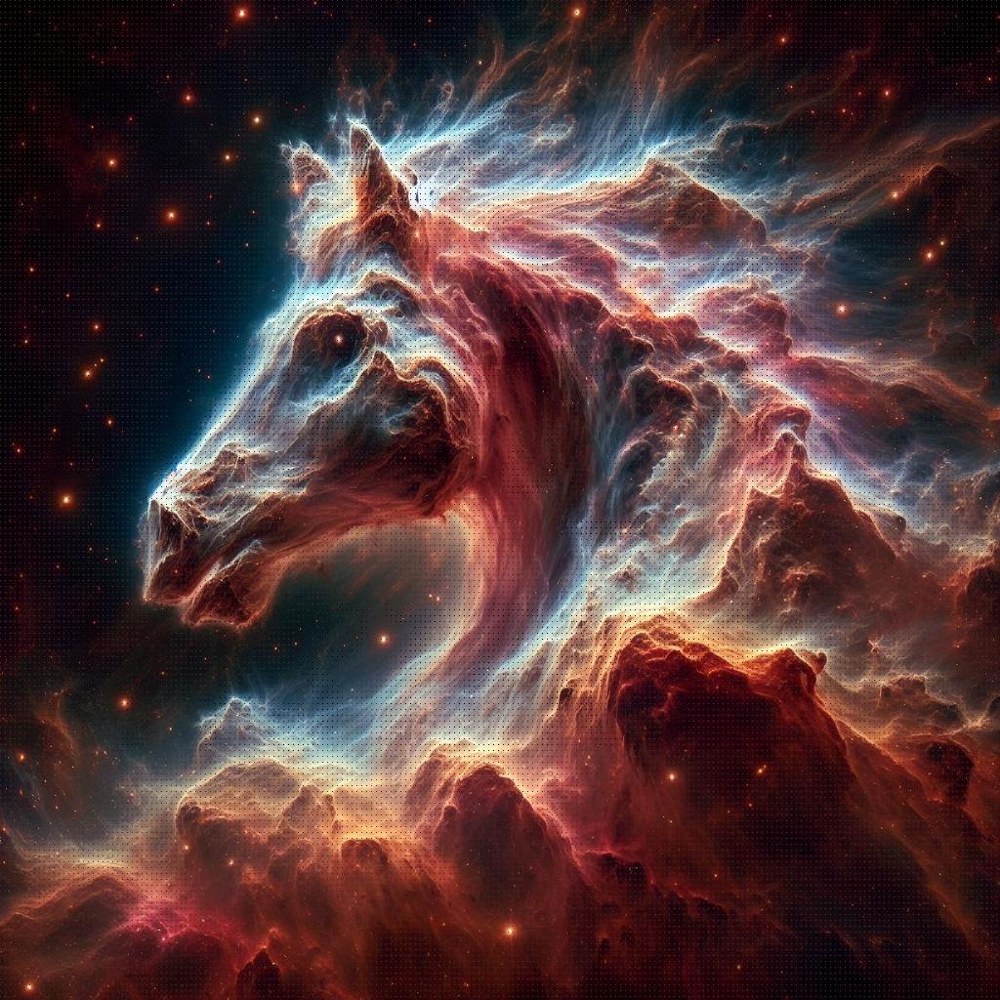
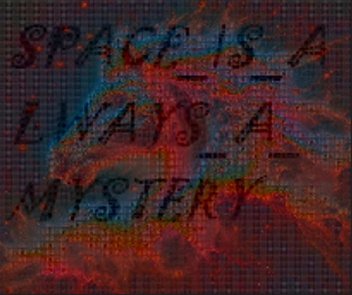

# garipat - MISC
**Açıklama:** 
Gizli bir şifre ile resim dosyası elimize geçti, bunu çözmelisin!

3 Dudvwlupdflodulplc elch ex jruvhol yh ex phwlql xodvwlugl (:) 15 Gthxb qxot jopz vpapzhxatgstc vtasx kt rthxiax dgpcapbpapg xat gthxbx xcrtatsxvxbxost  (5:6) 20 iluhchxu lymcgc eowofnolmye zulefc lymcgfyl vofohosil. cmfygc nugugfusuwue uxugcgct eufguxcac cwch voho mctch sujguhct aylyecsil. Vif muhm! 30 Viwqm oygypxyvoir tmowip wigmqmcpi oygypxqicm yryxqecmr

flag: `SKYSEC{SPACE_IS_ALWAYS_A_MYSTERY}`

# Writeup
Öncelikle metini incelediğimiz zaman normal yazılar ve aralara serpilmiş sayılar görüyoruz. Ardından bu sayılara göre bir önceki cümleyi 'Caesar Cipher' işlemi uyguladıktan sonra asıl metin bizi karşılıyor.
```
3 Arastirmacilarimiz bize bu gorseli ve bu metini ulastirdi 15 Resim bize uzak galaksilerden geldi ve cesitli oranlamalar ile resimi inceledigimizde (5:6) 20 oraninda resimi kucultursek farkli resimler bulunuyor. islemi tamamlayacak adamimiz kalmadigi icin bunu sizin yapmaniz gerekiyor. Bol sans! 30 Resmi kuculturken piksel secimiyle kucultmeyi unutmayin. 
```
Bu metine göre küçültme işlemimizi tüm resmi küçültmekten ziyade 5:6 şeklinde pikselleri seçip yeni resime aktardıktan sonra incelemek bizi çözüme ulaştıracaktır.
# Python Script
```python
from PIL import Image
import numpy as np

photo = Image.open('./image.jpeg')
img_arr = np.asarray(photo)
print(img_arr.shape)

new_img = []

for i, column in enumerate(img_arr):
    if i % 6 == 0:
        tmp_row = []
        for j, row in enumerate(column):
            if j % 5 == 0:
                tmp_row.append(row)
        new_img.append(tmp_row)

new_img_arr = np.array(new_img, dtype=np.uint8)

ni = Image.fromarray(new_img_arr)
print(ni.size)

ni.show()
```
# Çözüm
Script ile resimi yeniden işleyip görüntülediğimizde Flag karşımıza çıkıyor. Flag = 'SKYSEC{SPACE_IS_ALWAYS_A_MYSTERY}'



