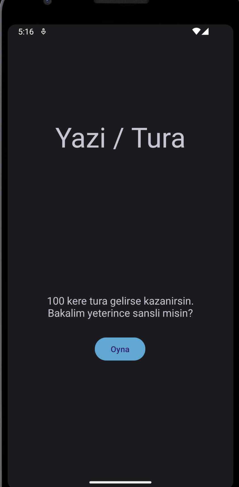
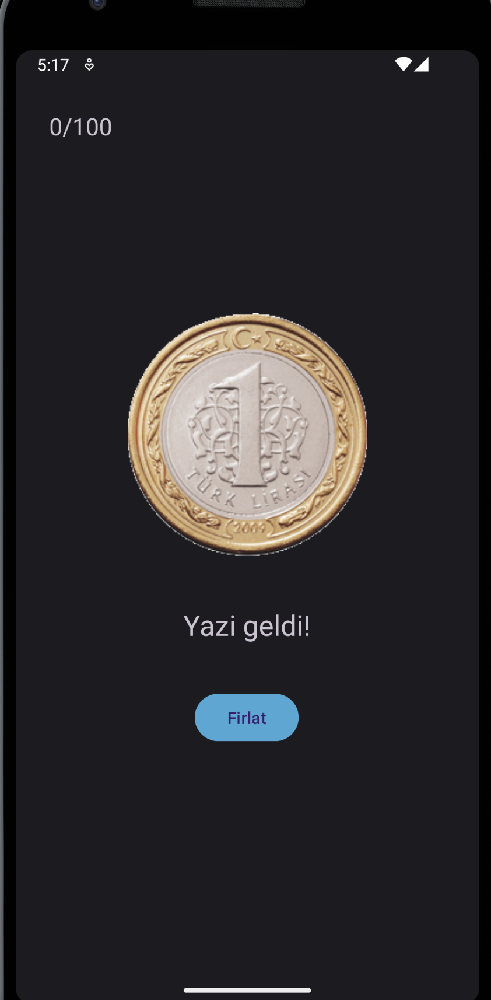
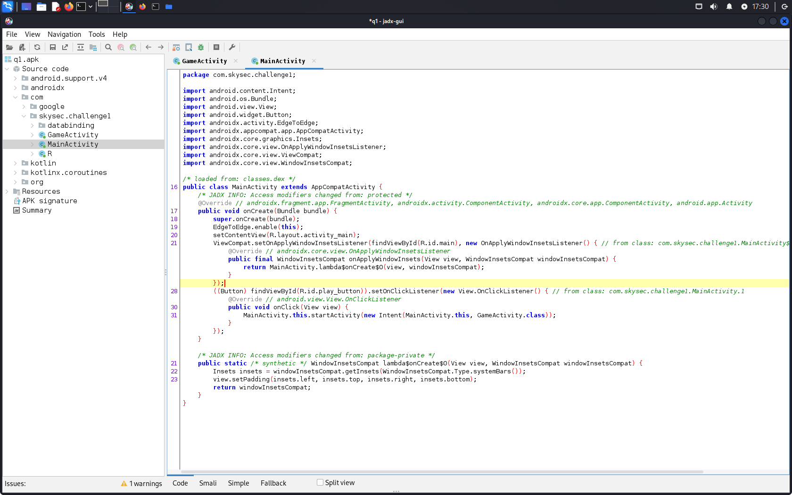
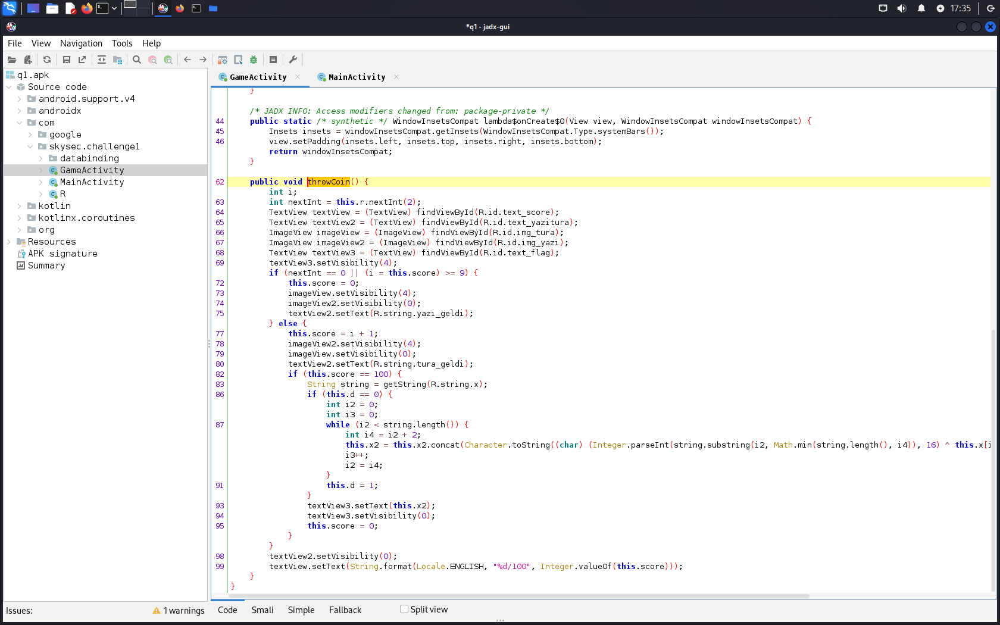
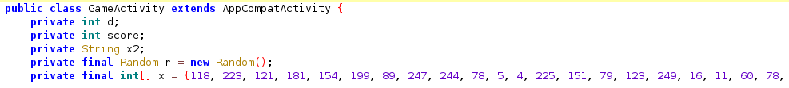

# Q1 - Mobile

flag: `SKYSEC{tur4n1n_n4z4r1_s4ns1n4_70z_k0ydu}`

# Writeup
Uygulamayı açtığımızda karşımıza çıkan görüntü:



Oyna butonuna basıp bir kere fırlatınca:



Elimizdeki bir apk dosyası olduğu için jadx-gui ile analiz edelim.



İki tane aktivite bulunduğunu görüyoruz. `MainActivity` de ilgi çekici bir şey bulunmuyor. Fakat `GameActivity` e baktığımızda (oyna butonuna bastığımızda açılan aktivite), 
fırlat butonuna basıldığında her seferinde çağırılacak `throwCoin` metodunu görüyoruz.



Sınıf tanımının başında geçen skor ismindeki sınıf değişkenini, Random tipindeki bir değişkeni, ve enteresan görünen x dizisi ile diğer tanımlanan değişkenleri görüyoruz.



`throwCoin` fonksiyonunda her atışta sonra rastgele olarak yazı veya turanın seçildiğini, eğer yazı geldiyse veya skor 9 değerine ulaşmışsa otomatik olarak skor değişkeninin 0 değerine eşitlendiğini görüyoruz.

Eğer tura geldiyse ve skor 9 değerine henüz ulaşmamışsa skor değerinin artırıldığını, eğer skor 100 değerine ulaştıysa çeşitli işlemler gerçekleştirilerek bir `textField` yapısında bayrağın gösterildiğini görüyoruz.

Bu noktada soruyu çözmenin birden çok yolu var. Ben, blok statik veriler üzerinde çalıştığından ve karmaşık bir yapı bulundurmadığından önemli olan bloğu ayrı bir java sınıfı oluşturarak çalıştırıp bayrağı minimal uğraşla elde etmeyi tercih ettim.

```java
import java.util.Random;

public class solve {

    public static void main(String[] args) {
                int score = 0;
                String x2 = "";
                final int[] x = {118, 223, 121, 181, 154, 199, 89, 247, 244, 78, 5, 4, 225, 151, 79, 123, 249, 16, 11, 60, 78, 131, 77, 249, 249, 47, 138, 92, 215, 245, 21, 216, 114, 131, 229, 28, 8, 39, 172, 4};
                String string = "259420e6df842283813c316ad0f91015cd6a3f4e7fdc3ecd975cbb32e3aa22e808dc8e2c7143d979";
                int i2 = 0;
                int i3 = 0;
                while (i2 < string.length()) {
                        int i4 = i2 + 2;
                        x2 = x2.concat(Character.toString((char) (Integer.parseInt(string.substring(i2, Math.min(string.length(), i4)), 16) ^ x[i3])));
                        i3++;
                        i2 = i4;
                }
                System.out.println(x2);
    }
}
```

Bu bloğu sjavac ile derleyip çalıştırdığımızda flagi elde ediyoruz.