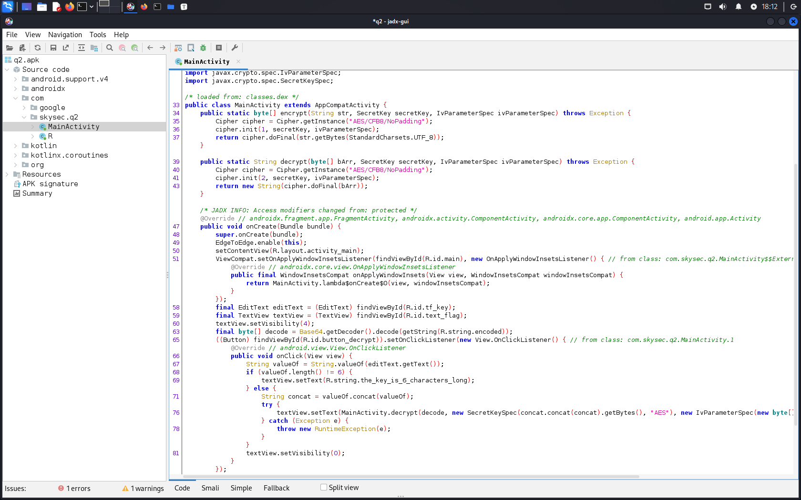
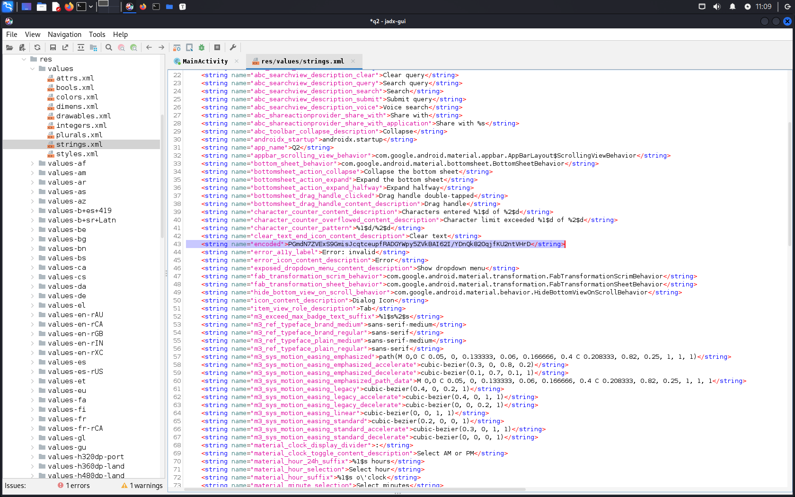

# Q2 - Mobile

flag: `SKYSEC{v4y_c4n1n4_d0stum_d0gru_buldun_17a737736}`

# Writeup
Elimizdeki bir apk dosyası olduğu için jadx-gui ile analiz edelim.



Bu uygulamada sadece MainActivity bulunduğunu görüyoruz. Jadx-gui çıktısını gözlemlediğmizde önceden şifrelenmiş bir verinin bizim vereceğimiz 6 karakterlik bir anahtarla çözülerek bize gösterileceğini anlıyoruz. Fakat aslında şifreleme işlemi için 24 karakterlik bir anahtar kullanılmış, bize 6 tane sunulmasının sebebi ne verirsek verelim 4 kere tekrarlayacak olması. Aslında olasılıkları azaltıyor demek oluyor bu da.

Soruda ip ucu olarak ilk iki harfin "DM" karakterleri olduğu bize söylenmişti. Buna göre soruyu python dilinde çözecek bir betik yazabiliriz.



Şifrelenmiş verinin kendisini de kaynaklar kısmında karakter dizinleri dosyasından buluyoruz. Bu şekilde hazırlayacağımız betikte bu şifrelenmiş veriyi base64'halinden geri çevirerek "DM" ve mümkün bütün 4 karakter uzunluğundaki kombinasyonları kullanarak içinde bayrak formatına uygun olan SKYSEC karakter dizininin geçtiği bir çıktıyı arıyoruz.

```py
from Crypto.Cipher import AES
import string
import base64
from itertools import product

def decrypt(enc, key, iv):
    cipher = AES.new(key, AES.MODE_CFB, iv)
    return cipher.decrypt(base64.b64decode(enc))

ciphertext_b64 = b"PGmdN7ZVExS9GmisJcqtceupfRADGYWpy5ZVkBAI62I/YDnQk82OqjfKU2ntVHrD"
charlist = string.digits + string.ascii_letters

init = "DM"
iv = b'\x00' * 16

for c in product(charlist, repeat=4):
    key = init + ''.join(c)
    key = (key * 4).encode()
    try:
        plaintext = decrypt(ciphertext_b64, key, iv)
        if b"SKYSEC" in plaintext:
            print(plaintext)
            exit(0)
    except Exception as e:
        print(e)
        exit(1)
```
