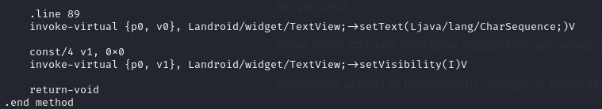

# Q3 - Mobile

flag: `SKYSEC{v4kt1nd3_p1d3l3r_z1p_z1p_h0p_h0p_87cxejL}`

# Writeup
Elimizdeki bir apk dosyası olduğu için jadx-gui ile analiz edelim.


İki tane aktivite olduğunu görüyoruz, bir emulatörde çalıştırdığımızda ise çok bir işlevi olmayan MainActivity'i görebiliyoruz sadece. Gizli olarak gösterilmeye çalışılsa da bu diğer aktivite de AndroidManifest dosyasında dışarı aktarılabilir olarak görünüyor. 

Bu da demek oluyor ki programı bu aktiviteden de başlatabiliriz. Fakat aktiviteyi çağırsak da ekstra bir uğraş göstermeden bayrağı göremeyeceğiz. 

Bu noktada benim tercihim smali kodunu değiştirip yeniden derleyerek programı çalıştırmak. Bunun için ilk olarak apktool ile dosyayı ayrıştırıyoruz.

`apktool d -r q3.apk`

Sonra smali kodunda istediğimiz değişiklikleri gerçekleştiriyoruz. Ben, hesaplar yapıldıktan sonra bayrağı bulunduran yazı alanının görülebilmesi için `setVisibility` metodunu kullanarak `textField`'in görünürlüğünü ayarladım.



`setVisibility` metodu, bir tamsayı değeri parametre olarak alıyor, 0 değeri görünür olmasi demek.

Sonrasında apktool ile birleştiriyoruz, zipalign ile hizalandırıyoruz ve imzalıyoruz.


Sonra çıktıdaki apk dosyasını emulatörümüze yukleyip saklı aktiviteyi çalıştırmak için am (activity manager)'den yararlanıyoruz.

```shell
adb install q3_aligned.apk
adb shell am start -n com.skysec.q3/.H1dd3n4ct1v1ty
```

Geri dönüp emulatöre baktığımızda karşımıza bayrak çıkıyor.

SKYSEC{v4kt1nd3_p1d3l3r_z1p_z1p_h0p_h0p_87cxejL}
