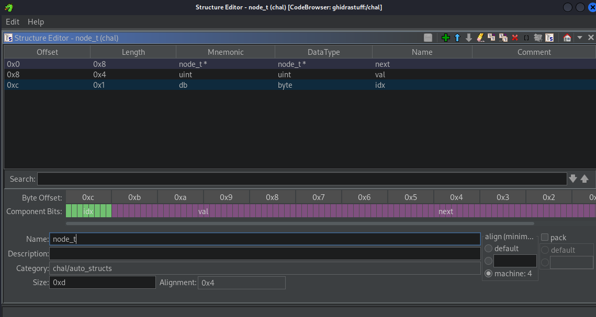

# chall - Reverse

flag: `SKYSEC{1e9af21d6f21d6f1e9af2fc2f1e9af2fc2f29daf1e9af21d6f2242f296ef2f56f1e2ef1f96f2242f2f56f29daf1e2ef1e9af3a96f2242f296ef21d6f2f56f2002f375af1e9af2002f2242f2002f1e9af}`

Elimizdeki dosyanin bir elf dosyasi oldugunu ilk is olarak file komutuyla inceledikten sonra ogreniyoruz.

chal: ELF 64-bit LSB pie executable, x86-64, version 1 (SYSV), dynamically linked, interpreter /lib64/ld-linux-x86-64.so.2, BuildID[sha1]=b839671aedb7184024bafc0db695cf851ea9cdd2, for GNU/Linux 3.2.0, stripped

Oncelikle dosyayi calistirdigimizda karsimiza ne oldugu anlasilmayan, gorundugu kadariyla hex olmaya uygun uzun bir cikti geliyor. Bayragin da dogru cevabin bayrak formatina yerlestirilmis hali oldugunu goruyoruz.

```shell
1ec11ec129952fe93abd21fd2269202922691ec12a011e5521fd2f7d2a011ec1299521fd22691ec12f7d22691e5520291fbd2f7d2029378121fd2fe91ec11ec1

[info] The flag is SKYSEC{correct_input}
```

Simdi bu programin calisma mantigina giris yapmaliyiz. Analiz etmek uzere ghidra ile acalim.

Baktigimizda dosyanin stripped oldugunu, yani icinde sembolleri icermedigini goruyoruz. Ghidrada butun fonksiyonlarin ismi anlasilmayacak durumda.

Programin giris noktasinda `__libc_start_main` fonksiyonuna parametre olarak verilen fonksiyondan `main` fonksiyonunu bulabiliyoruz.

Bu sorunun cozumunde onemli olan noktalardan birisi bize verilen ciktinin anlamini bulmak, bunun icin de ilk cikti bastirilan noktaya kadar gerceklestirilen islemleri anlamak mantikli olacaktir.

Ilk bakista tanimlanan bir cok degiskenin yaninda iki tane dongu goruyoruz. Bunlardan birisi 32, digeri 16 kez donuyor. Dongu icinde tekrarlanan fonksiyonlarin aldiklari parametrelerin benzer oldugunu goruyoruz.

```c
  uStack_20 = 0x632020409043106;
  local_28 = 0x7340409043504;
  uStack_10 = 0x301090702020306;
  uStack_18 = 0x3131000608320508;
  uStack_40 = 0x1d0b0f090406010e;
  local_48 = 0x1118031719080c1b;
  uStack_30 = 0x1e00140a021f1310;
  uStack_38 = 0x151c071a12050d16;
  local_58 = 0x30a050301040601;
  uStack_50 = 0x1010305050c070c;
  local_60 = 0;
  local_68 = 0;
  for (local_4 = 0; local_4 < 0x20; local_4 = local_4 + 1) {
    FUN_00100f5c(&local_60,*(undefined *)((long)&local_48 + (long)local_4),
                 *(byte *)((long)&local_28 + (long)local_4) + 0x30);
  }
  for (local_4 = 0; local_4 < 0x10; local_4 = local_4 + 1) {
    FUN_00101004(&local_68,*(undefined *)((long)&local_58 + (long)local_4),
                 *(undefined *)((long)&local_48 + (long)local_4));
  }
  memset(&local_28,0,0x20);
  memset(&local_58,0,0x10);
  FUN_001010ac(&local_60,&local_68);
  FUN_00100d74(&local_60);
  uStack_80 = 0x17071a081f040018;
  local_88 = 0x1d0c1012020b140e;
  uStack_70 = 0xd0601161e0a0903;
  uStack_78 = 0x1b1115130f05191c;
  local_98 = 0xc01020307010301;
  uStack_90 = 0x103010704030c01;
  puts("[info] The flag is SKYSEC{correct_input}\n");
```

Ayrica goze carpan 4 fonksiyon var, genel olarak bir goz gezdirdigimizde `FUN_00100d74` fonksiyonunun terminale cikti ureten bir fonksiyon oldugunu goruyoruz.

```c
int FUN_00100d74(undefined8 *param_1)

{
  int iVar1;
  byte local_9;
  undefined8 *local_8;
  
  putchar(10);
  local_8 = (undefined8 *)*param_1;
  local_9 = 0;
  while ((local_8 != (undefined8 *)0x0 && (local_9 < 0x20))) {
    if (local_9 == *(byte *)((long)local_8 + 0xc)) {
      printf("%4llx",(ulong)*(uint *)(local_8 + 1));
      local_9 = local_9 + 1;
      local_8 = (undefined8 *)*param_1;
    }
    else {
      local_8 = (undefined8 *)*local_8;
    }
  }
  iVar1 = puts("\n");
  return iVar1;
}
```

Burada yazdirilan her seyin `%4llx` formatinda yazdirilmis olmasi bize gordugumuz verinin 4lu karakterlere bolunecegini gosteriyor. Baktigimizda `local_9` un byte olarak tanimlandigini, `local_8` in de `param_1` in gosterdigi adres olarak tanimlandigini goruyoruz. Dongunun icinde `local_9` degerinin 32 ile karsilastirildigini ve `local_8` in `NULL` ile karsilastirildigini goruyoruz. Dahasi, `local_9` degiskeni her yazim isleminden sonra 1 artiriliyor. Ayni zamanda ilk `if` blogunda kosul olarak `local_9` degerinin `local_8` in 12 bayt sonrasindaki adreste saklanan degere esit olup olmadigi sorgulaniyor.

Buradan cikarabildiklerimiz:

- `local_8` bir bagli (linked) listeyi gosteren bir isaretcidir (pointer).
- bu listenin 32 elemani vardir.
- linkli liste elemanlarinin yapisinda 12. baytin ifade ettigi deger bir tur indis degeridir. (bu fonksiyon 0dan baslayarak 31 degeri dahil olacak sekilde sirayla elemanlari yazdiriyor)

Bu fonksiyonu `print_list` olarak isimlendiriyorum. Sonra da `local_8` uzerine gelerek ghidra'nin otomatik yapi (struct) olusturma ozelliginden yararlaniyorum.



Gorebildigimiz uzere bu yapida ilk eleman bir baska yapi ornegine isaret ediyor (bu onceki veya sonraki olabilir), ayni zamanda bu yapida iki eleman daha bulunuyor. Gordugumuz son eleman ise `print_list` fonksiyonunda eleman sirasi kontrolu icin kullanilmisti.

Bu verilerden ilerleyerek kendime uygun buldugum `next`, `val`, ve `idx` isimlerini bu alanlara yerlestirdim.

Simdi baktigimizda `print_list` fonksiyonu cok daha anlasilir gorunuyor. Simdi indisleri 0'dan sirali olarak degerleri bize verdigini de ogrenmis olduk.

```c
int print_list(void **p_list)
{
  int ret;
  byte cur_idx;
  node_t *cur_elem;
  
  putchar(10);
  cur_elem = (node_t *)*p_list;
  cur_idx = 0;
  while ((cur_elem != (node_t *)0x0 && (cur_idx < 0x20))) {
    if (cur_idx == cur_elem->idx) {
      printf("%4llx",(ulong)cur_elem->val);
      cur_idx = cur_idx + 1;
      cur_elem = (node_t *)*p_list;
    }
    else {
      cur_elem = cur_elem->next;
    }
  }
  ret = puts("\n");
  return ret;
}
```

`print_list` fonksiyonu, `main` fonksiyonunda `local_60` degiskeninin adresi ile cagriliyor. Yani bu degisken de bir bagli liste olacak. Benzer sekilde `main` fonksiyonunu incelerken bahsettigimiz diger dongudeki `local_68` degiskeni de bir bagli liste oluyor demek ki.

Bu ana kadar elde ettigimiz bilgilerle ghidra da fonksiyonlarin imzalarini `function signature` degistirerek ve degiskenleri isimlendirerek genel olarak daha okunakli bir sonuca ulasiyoruz.

Simdi dongulerde yapilan islemleri anlamaya calisalim.

```c
  uStack_20 = 0x632020409043106;
  local_28 = 0x7340409043504;
  uStack_10 = 0x301090702020306;
  uStack_18 = 0x3131000608320508;
  uStack_40 = 0x1d0b0f090406010e;
  local_48 = 0x1118031719080c1b;
  uStack_30 = 0x1e00140a021f1310;
  uStack_38 = 0x151c071a12050d16;
  local_58 = 0x30a050301040601;
  uStack_50 = 0x1010305050c070c;
  local_60 = 0;
  local_68 = 0;
  for (i = 0; i < 0x20; i = i + 1) {
    FUN_00100f5c(&local_60,*(undefined *)((long)&local_48 + (long)i),
                 *(byte *)((long)&local_28 + (long)i) + 0x30);
  }
  for (i = 0; i < 0x10; i = i + 1) {
    FUN_00101004(&local_68,*(undefined *)((long)&local_58 + (long)i),
                 *(undefined *)((long)&local_48 + (long)i));
  }
```

Ilk dongude calistirilan fonksiyonun artik bir bagli listeye eleman ekleme fonksiyonu oldugunu direkt olarak gorebiliyoruz.

```c
void FUN_00100f5c(node_t **p_list,byte idx,uint val)
{
  node_t *__s;
  node_t *local_8;
  
  local_8 = *p_list;
  __s = (node_t *)malloc(0x10);
  memset(__s,0,0x10);
  __s->val = val;
  __s->idx = idx;
  if (*p_list == (node_t *)0x0) {
    *p_list = __s;
  }
  else {
    for (; local_8->next != (node_t *)0x0; local_8 = local_8->next) {
    }
    local_8->next = __s;
  }
  return;
}
```

Bu fonksiyonu `append_linked_list_0` olarak isimlendirdim. Ikinci dongude calisan fonksiyonun da ayni amaca hizmet ettigi belli. Ghidra araciligiyla otomatik yapi olusturmaya calisinca eleman boyutlari tam olarak belirlenemese de fonksiyonu inceleyince `append_linked_list_0` dan cok farkli bir manzara olmadigini anliyoruz.

```c
void FUN_00101004(astruct **param_1,undefined param_2,undefined4 param_3)

{
  astruct *__s;
  astruct *local_8;
  
  local_8 = *param_1;
  __s = (astruct *)malloc(0x10);
  memset(__s,0,0x10);
  __s->field_0x8 = param_2;
  __s->field12_0xc = param_3;
  if (*param_1 == (astruct *)0x0) {
    *param_1 = __s;
  }
  else {
    for (; *(long *)local_8 != 0; local_8 = *(astruct **)local_8) {
    }
    *(astruct **)local_8 = __s;
  }
  return;
}
```

Yine 3 alanli bir yapi, ilk eleman ayni sekilde listedeki sonraki elemani gosteriyor olacak. Fakat diger iki alan ile ilgili net bir bilgimiz yok.

Biraz daha duzenleyince daha guzel gorunuyor, bunu da `append_linked_list_1` olarak isimlendiriyorum. Bu bagli liste de biliyoruz ki 16 elemandan olusacak.

```c
void FUN_00101004(node_t2 **p_list,uint8_t unk0,int unk1)
{
  node_t2 *__s;
  node_t2 *local_8;
  
  local_8 = *p_list;
  __s = (node_t2 *)malloc(0x10);
  memset(__s,0,0x10);
  *(uint8_t *)&__s->unk0 = unk0;
  *(int *)&__s->unk1 = unk1;
  if (*p_list == (node_t2 *)0x0) {
    *p_list = __s;
  }
  else {
    for (; local_8->next != 0; local_8 = (node_t2 *)local_8->next) {
    }
    local_8->next = __s;
  }
  return;
}
```

Bu noktada dongulerden sonra iki linkli listeyle birlikte cagrilan bir fonksiyonu goruyoruz.

Bu fonksiyon, ikinci bagli listeyi eleman eleman geziyor ve eger o elemanin `unk0` alaninin en kucuk anlamli biti 1 degerine sahipse bir fonksiyon, degilse baska bir fonksiyon cagriliyor.

```c
void FUN_001010ac(node_t **p_list,node_t2 **p_list2)
{
  node_t2 *cur;
  
  for (cur = *p_list2; cur != (node_t2 *)0x0; cur = (node_t2 *)cur->next) {
    if ((*(byte *)&cur->unk0 & 1) == 0) {
      FUN_00101258(p_list,*(undefined4 *)&cur->unk1,*(undefined *)&cur->unk0);
    }
    else {
      FUN_00101148(p_list,*(undefined4 *)&cur->unk1,*(undefined *)&cur->unk0);
    }
  }
  return;
}
```

Bir katman daha iceri girdigimizde bu ayrisimin mantigini kavriyoruz. Eger su anki eleanin `unk0` alaninin en kucuk anlami biti 1 degerine sahip degilse, `FUN_00101258` fonksiyonu sirasiyla bagli liste isaretcisi, `unk1` alanini gosteren adres ve `unk0` alanini gosteren adres ile cagriliyor. 

```c
void FUN_00101258(undefined8 *param_1,uint param_2,int param_3)

{
  uint uVar1;
  char cVar2;
  bool bVar3;
  uint local_1c;
  uint local_c;
  undefined8 *local_8;
  
  local_1c = param_2;
  for (local_8 = (undefined8 *)*param_1; local_8 != (undefined8 *)0x0;
      local_8 = (undefined8 *)*local_8) {
    if ((param_3 != 0xe) && (param_3 < 0xf)) {
      if (param_3 == 0xc) {
        *(uint *)(local_8 + 1) = ~*(uint *)(local_8 + 1);
      }
      else if (param_3 < 0xd) {
        if (param_3 == 10) {
          *(uint *)(local_8 + 1) = *(uint *)(local_8 + 1) ^ local_1c;
        }
        else if (param_3 < 0xb) {
          if (param_3 == 8) {
            *(uint *)(local_8 + 1) = *(uint *)(local_8 + 1) & local_1c;
          }
          else if (param_3 < 9) {
            if (param_3 == 6) {
              *(uint *)(local_8 + 1) = *(uint *)(local_8 + 1) | local_1c;
            }
            else if ((param_3 < 7) && ((param_3 == 2 || (param_3 == 4)))) {
              uVar1 = -local_1c;
              bVar3 = (int)local_1c < 1;
              local_1c = local_1c & 0x1f;
              if (bVar3) {
                local_1c = -(uVar1 & 0x1f);
              }
              if (param_3 == 2) {
                cVar2 = -0x20;
                local_c = local_1c;
              }
              else {
                local_c = -local_1c;
                cVar2 = ' ';
              }
              *(char *)((long)local_8 + 0xc) = *(char *)((long)local_8 + 0xc) + (char)local_c;
              if (0x1f < *(byte *)((long)local_8 + 0xc)) {
                *(char *)((long)local_8 + 0xc) = *(char *)((long)local_8 + 0xc) + cVar2;
              }
            }
          }
        }
      }
    }
  }
  return;
}
```

Ilk bakista biraz karisik gorunuyor. Fakat parametrelerin ne oldugunu farkettigimizde ve gerekli isimlendirmeleri yaptigimizda daha rahat anlasilacak.

Bu haliyle baktigimizda, aslinda `unk0` alaninin gerceklestirilecek isleme karar vermek icin kullanilan bir deger oldugunu, ve `FUN_00101258` fonksiyonunun bit bazinda operasyonlar / lojik operasyonlar gerceklestirdigini goruyoruz. Tek girdili (unary) olmayan operatorler icin ise kullanilan degerin `unk1` alanindaki deger oldugunu goruyoruz. Buradan yola cikarak bu fonksiyonun lojik isleme fonksiyonu oldugunu ve arguman olarak verilen `unk1`, `unk0` alanlarini icinde bulunduran elemanin ait oldugu bagli listenin de komut listlesi oldugunu cikarabiliriz. Bu durumda `p_list` isaretcisinin gosterdigi bagli liste de veri listesi oluyor.

```c
void FUN_00101258(node_t **p_list,int unk1,uint8_t unk0)
{
  uint uVar1;
  char cVar2;
  bool bVar3;
  uint local_1c;
  uint local_c;
  node_t *cur;
  
  local_1c = unk1;
  for (cur = *p_list; cur != (node_t *)0x0; cur = cur->next) {
    if ((unk0 != '\x0e') && (unk0 < 0xf)) {
      if (unk0 == '\f') {
        cur->val = ~cur->val;
      }
      else if (unk0 < 0xd) {
        if (unk0 == '\n') {
          cur->val = cur->val ^ local_1c;
        }
        else if (unk0 < 0xb) {
          if (unk0 == '\b') {
            cur->val = cur->val & local_1c;
          }
          else if (unk0 < 9) {
            if (unk0 == '\x06') {
              cur->val = cur->val | local_1c;
            }
            else if ((unk0 < 7) && ((unk0 == '\x02' || (unk0 == '\x04')))) {
              uVar1 = -local_1c;
              bVar3 = (int)local_1c < 1;
              local_1c = local_1c & 0x1f;
              if (bVar3) {
                local_1c = -(uVar1 & 0x1f);
              }
              if (unk0 == '\x02') {
                cVar2 = -0x20;
                local_c = local_1c;
              }
              else {
                local_c = -local_1c;
                cVar2 = ' ';
              }
              cur->idx = cur->idx + (char)local_c;
              if (0x1f < cur->idx) {
                cur->idx = cur->idx + cVar2;
              }
            }
          }
        }
      }
    }
  }
  return;
}
```

Geri kalan isi kolaylastirmak adina gerekli isim degisikliklerini ghidra da gerceklestirdim. Bu fonksiyon lojik isledigine gore diger fonksiyonu inceleyip aritmetik islemler icin kullanildigini gormek basit. Ikisi arasinda tercih yapan fonksiyona da genel bir isim olarak `process` ismini uygun gordum.

`main` deki `puts` ifadesinden hemen sonra bir fonksiyonun cagrildigini goruyoruz. Bu fonksiyonu actigimiz an bir alan bosaltma (deallocation) fonksiyonu oldugu belli oluyor. Baktigimizda `FUN_001014a4` ve `FUN_0010144c` ayni gorevi karsiliyorlar fakat bir tanesi komut listesi icin kullanilirken digeri veri listesi icin kullaniliyor. Buna gore isimlendiriyorum.

```c
  FUN_001014a4(&instruction_list);
  uStack_130 = 0;
  local_138 = 0;
  uStack_120 = 0;
  uStack_128 = 0;
  uStack_110 = 0;
  local_118 = 0;
  uStack_100 = 0;
  uStack_108 = 0;
  uStack_f0 = 0;
  local_f8 = 0;
  uStack_e0 = 0;
  uStack_e8 = 0;
  uStack_d0 = 0;
  local_d8 = 0;
  uStack_c0 = 0;
  uStack_c8 = 0;
  uStack_b0 = 0;
  local_b8 = 0;
  uStack_a0 = 0;
  uStack_a8 = 0;
  local_140 = (d_list *)0x0;
  read(0,&local_138,0xa0);
  getchar();
  FUN_00100e20(&local_140,&local_88,&local_138);
  for (i = 0; i < 0x10; i = i + 1) {
    append_linked_list_1
              (&instruction_list,*(uint8_t *)((long)&local_98 + (long)i),
               (uint)*(byte *)((long)&local_88 + (long)i));
  }
  memset(&local_98,0,0x10);
  process(&local_140,&instruction_list);
  iVar1 = FUN_00100c34(&data_list,&local_140);
  if (iVar1 == 0) {
    puts("\nCORRECT.");
  }
  else {
    puts("\nINCORRECT.");
  }
  FUN_0010144c(&data_list);
  FUN_0010144c(&local_140);
  FUN_001014a4(&instruction_list);
  return 0;
```

Fark edebilecegimiz bir baska sey, bagli listeler olusturulduktan sonra kullanilan `memset` cagrilari. Bagli listeler olusturulduktan sonra olusturma sirasinda kullanilan adreslerde bulunan degerleri 0'liyor. Elde etmis oldugumuz bilgilerle 0'lanan alanlarin neleri ifade ettigini cozebiliriz.

Yeni haliyle donguler daha duzgun oldu, isim olarak `delta_arr` secmemin sebebi kullandigi her degerin uzerine ekledigi `0x30` degeri. Ayni zamanda fark ediyoruz ki veri listesinde kullanilan indis degerleri ilk seferde komutlar icin girdi (operand) olarak kullaniliyormus.

```c
  uStack_20 = 0x632020409043106;
  delta_arr = 0x7340409043504;
  uStack_10 = 0x301090702020306;
  uStack_18 = 0x3131000608320508;
  uStack_40 = 0x1d0b0f090406010e;
  idx_arr = 0x1118031719080c1b;
  uStack_30 = 0x1e00140a021f1310;
  uStack_38 = 0x151c071a12050d16;
  operation_arr = 0x30a050301040601;
  uStack_50 = 0x1010305050c070c;
  data_list = (d_list *)0x0;
  instruction_list = (i_list *)0x0;
  for (i = 0; i < 0x20; i = i + 1) {
    append_data(&data_list,*(undefined *)((long)&idx_arr + (long)i),
                *(byte *)((long)&delta_arr + (long)i) + 0x30);
  }
  for (i = 0; i < 0x10; i = i + 1) {
    append_instruction(&instruction_list,*(uint8_t *)((long)&operation_arr + (long)i),
                       (uint)*(byte *)((long)&idx_arr + (long)i));
  }
  memset(&delta_arr,0,0x20);
  memset(&operation_arr,0,0x10);
```

Su anda nasil calistigi hakkinda fikrimiz bulunmayan 2 fonksiyon var. Bir tanesi cevabimizin dogrulugunu kontrol eden fonksiyon, digeri de kullanicidan veri alindiktan sonra cagrilan fonksiyon. Sahsen kontrol noktasini incelemeye karar verdim. Ismini `check` olarak degistirdim ve gerekli parametreleri belirledim.

Bildigimiz kadariyla veriler uzerinde cesitli komutlar calistiriliyor, bu verilerin yapisinda bulunan alanlar ise: bir sonraki yapiya giden isaretci, verinin degeri, verinin indisi olarak kabul edilen deger. Kontrol fonksiyonuna baktigimizda bizden istenilenin; otomatik olarak islenen veriler listesinin, ve bizden alinan veriler uzerinde uygulanan operasyonlar sonucu olusan veri listesinin indisler de eslendiginde gosterdikleri degerlerin ayni olmasi.

```c
int check(d_list **data_list,d_list **input_data_list)
{
  d_list *cur_1;
  d_list *cur_0;
  int correct_incorrect;
  byte cur_idx;
  
  cur_idx = 0;
  correct_incorrect = 0;
  cur_0 = *data_list;
  cur_1 = *input_data_list;
  while ((cur_idx < 0x20 && (correct_incorrect == 0))) {
    if (cur_0 == (d_list *)0x0) {
      cur_0 = *data_list;
    }
    if (cur_1 == (d_list *)0x0) {
      cur_1 = *input_data_list;
    }
    if ((cur_idx == cur_0->idx) && (cur_idx == cur_1->idx)) {
      if (cur_0->val == cur_1->val) {
        cur_idx = cur_idx + 1;
      }
      else {
        correct_incorrect = 1;
      }
    }
    else if (cur_idx == cur_0->idx) {
      cur_1 = cur_1->next;
    }
    else if (cur_idx == cur_1->idx) {
      cur_0 = cur_0->next;
    }
    else {
      cur_0 = cur_0->next;
      cur_1 = cur_1->next;
    }
  }
  return correct_incorrect;
}
```

Simdiki durumda

- amacimizi biliyoruz
- bahsedilen indislerin kontrol disinda nasil bir oneminin oldugunu bilmiyoruz
- bizden istenen verinin nasil islenecegini bilmiyoruz, ne tur operasyonlardan gececegini bilmiyoruz

En cok ortak noktaya hitap ettigini dusundugum operasyonlarin sayisal karsiliklarini bulma sureciyle baslayabiliriz. Bildigimiz uzere bir operasyonun degeri cift sayiysa lojik, tek sayiysa aritmetik islemlere karsilik geliyor.

Aritmetik operasyonlari inceledigimizde

- 7 degeri bolme
- 5 degeri carpma
- 1 degeri toplama
- 3 degeri cikarma

Operasyonlarina denk geliyor.

```c
void arithmetic(d_list **data_list,int operand,uint8_t operation)
{
  uint uVar1;
  d_list *cur;
  
  for (cur = *data_list; cur != (d_list *)0x0; cur = cur->next) {
    if (operation == 7) {
      if (operand != 0) {
        uVar1 = 0;
        if (operand != 0) {
          uVar1 = (int)cur->val / operand;
        }
        cur->val = uVar1;
      }
    }
    else if (operation < 8) {
      if (operation == 5) {
        cur->val = cur->val * operand;
      }
      else if (operation < 6) {
        if (operation == 1) {
          cur->val = cur->val + operand;
        }
        else if (operation == 3) {
          cur->val = cur->val - operand;
        }
      }
    }
  }
  return;
}
```

Lojik operasyonlari inceledigimizde

- 12 degeri bitwise not
- 10 degeri xor
- 8 degeri and
- 6 degeri or
- 4 ROL
- 2 ROR

Islemlerine denk geliyor. Tabii bu dondurme (rotate) islemleri sadece elemanin idx alaninda bulunan degeri degistiriyor.

```c
void logic(d_list **p_list,int operand,uint8_t operation)
{
  uint uVar1;
  char cVar2;
  bool bVar3;
  uint _operand;
  uint local_c;
  d_list *cur;
  
  _operand = operand;
  for (cur = *p_list; cur != (d_list *)0x0; cur = cur->next) {
    if ((operation != '\x0e') && (operation < 0xf)) {
      if (operation == '\f') {
        cur->val = ~cur->val;
      }
      else if (operation < 0xd) {
        if (operation == '\n') {
          cur->val = cur->val ^ _operand;
        }
        else if (operation < 0xb) {
          if (operation == '\b') {
            cur->val = cur->val & _operand;
          }
          else if (operation < 9) {
            if (operation == '\x06') {
              cur->val = cur->val | _operand;
            }
            else if ((operation < 7) && ((operation == '\x02' || (operation == '\x04')))) {
              uVar1 = -_operand;
              bVar3 = (int)_operand < 1;
              _operand = _operand & 0x1f;
              if (bVar3) {
                _operand = -(uVar1 & 0x1f);
              }
              if (operation == '\x02') {
                cVar2 = -0x20;
                local_c = _operand;
              }
              else {
                local_c = -_operand;
                cVar2 = ' ';
              }
              cur->idx = cur->idx + (char)local_c;
              if (0x1f < cur->idx) {
                cur->idx = cur->idx + cVar2;
              }
            }
          }
        }
      }
    }
  }
  return;
}
```

Operasyonlari birlestirdigimizde:

- 7 bolme
- 5 carpma
- 1 toplama
- 3 cikarma
- 0c degeri bitwise not
- 0a degeri xor
- 8 degeri and
- 6 degeri or
- 4 ROL
- 2 ROR

Olmak uzere 10 operasyonumuzun bulundugunu goruyoruz.

Buradan sonra ghidranin da verdigi verilere ve bildigimiz liste boyutlarina gore otomatik isimlendirilmis yerel degiskenleri ve yigin degiskenlerini yeniden isimlendirdim. `main` fonksiyonunu yeni haliyle gorelim. Her sey daha cok anlam kazandigina gore simdi bize verilen ciktiyi yorumlayabiliriz, verdigimiz girdinin nasil islenecegine ve ne tur operasyonlardan gececegine bakabiliriz. Bunlari tayin ettikten sonra cozume daha yakin olacagiz.

```c
undefined8 main(void)

{
  int iVar1;
  d_list *input_data_list;
  undefined8 input_buffer;
  undefined8 input_buffer_1;
  undefined8 input_buffer_2;
  undefined8 input_buffer_3;
  undefined8 input_buffer_4;
  undefined8 input_buffer_5;
  undefined8 input_buffer_6;
  undefined8 input_buffer_7;
  undefined8 input_buffer_8;
  undefined8 input_buffer_9;
  undefined8 input_buffer_0a;
  undefined8 input_buffer_0b;
  undefined8 input_buffer_0c;
  undefined8 input_buffer_0d;
  undefined8 input_buffer_0e;
  undefined8 input_buffer_0f;
  undefined8 input_buffer_10;
  undefined8 input_buffer_11;
  undefined8 input_buffer_12;
  undefined8 input_buffer_13;
  undefined8 operation_arr_for_userinp;
  undefined8 operation_arr_for_userinp_cont;
  undefined8 operand_arr_for_userinp;
  undefined8 operand_arr_for_userinp_1;
  undefined8 operand_arr_for_userinp_2;
  undefined8 operand_arr_for_userinp_3;
  i_list *instruction_list;
  d_list *data_list;
  undefined8 operation_arr;
  undefined8 operation_arr_cont;
  undefined8 idx_arr;
  undefined8 idx_arr_1;
  undefined8 idx_arr_2;
  undefined8 idx_arr_3;
  undefined8 delta_arr;
  undefined8 delta_arr_1;
  undefined8 delta_arr_2;
  undefined8 delta_arr_3;
  int i;
  
  delta_arr_1 = 0x632020409043106;
  delta_arr = 0x7340409043504;
  delta_arr_3 = 0x301090702020306;
  delta_arr_2 = 0x3131000608320508;
  idx_arr_1 = 0x1d0b0f090406010e;
  idx_arr = 0x1118031719080c1b;
  idx_arr_3 = 0x1e00140a021f1310;
  idx_arr_2 = 0x151c071a12050d16;
  operation_arr = 0x30a050301040601;
  operation_arr_cont = 0x1010305050c070c;
  data_list = (d_list *)0x0;
  instruction_list = (i_list *)0x0;
  for (i = 0; i < 0x20; i = i + 1) {
    append_data(&data_list,*(undefined *)((long)&idx_arr + (long)i),
                *(byte *)((long)&delta_arr + (long)i) + 0x30);
  }
  for (i = 0; i < 0x10; i = i + 1) {
    append_instruction(&instruction_list,*(uint8_t *)((long)&operation_arr + (long)i),
                       (uint)*(byte *)((long)&idx_arr + (long)i));
  }
  memset(&delta_arr,0,0x20);
  memset(&operation_arr,0,0x10);
  process(&data_list,&instruction_list);
  print_list(&data_list);
  operand_arr_for_userinp_1 = 0x17071a081f040018;
  operand_arr_for_userinp = 0x1d0c1012020b140e;
  operand_arr_for_userinp_3 = 0xd0601161e0a0903;
  operand_arr_for_userinp_2 = 0x1b1115130f05191c;
  operation_arr_for_userinp = 0xc01020307010301;
  operation_arr_for_userinp_cont = 0x103010704030c01;
  puts("[info] The flag is SKYSEC{correct_input}\n");
  dealloc_instruction(&instruction_list);
  input_buffer_1 = 0;
  input_buffer = 0;
  input_buffer_3 = 0;
  input_buffer_2 = 0;
  input_buffer_5 = 0;
  input_buffer_4 = 0;
  input_buffer_7 = 0;
  input_buffer_6 = 0;
  input_buffer_9 = 0;
  input_buffer_8 = 0;
  input_buffer_0b = 0;
  input_buffer_0a = 0;
  input_buffer_0d = 0;
  input_buffer_0c = 0;
  input_buffer_0f = 0;
  input_buffer_0e = 0;
  input_buffer_11 = 0;
  input_buffer_10 = 0;
  input_buffer_13 = 0;
  input_buffer_12 = 0;
  input_data_list = (d_list *)0x0;
  read(0,&input_buffer,0xa0);
  getchar();
  FUN_00100e20(&input_data_list,&operand_arr_for_userinp,&input_buffer);
  for (i = 0; i < 0x10; i = i + 1) {
    append_instruction(&instruction_list,*(uint8_t *)((long)&operation_arr_for_userinp + (long)i),
                       (uint)*(byte *)((long)&operand_arr_for_userinp + (long)i));
  }
  memset(&operation_arr_for_userinp,0,0x10);
  process(&input_data_list,&instruction_list);
  iVar1 = check(&data_list,&input_data_list);
  if (iVar1 == 0) {
    puts("\nCORRECT.");
  }
  else {
    puts("\nINCORRECT.");
  }
  dealloc_data(&data_list);
  dealloc_data(&input_data_list);
  dealloc_instruction(&instruction_list);
  return 0;
}
```

Simdi verecegimiz girdinin nasil islenecegiyle ilgilenen fonksiyona bakalim.

```c
void parse_input(d_list **param_1,long param_2,long param_3)
{
  long lVar1;
  undefined4 local_18;
  undefined local_14;
  undefined4 local_10;
  int local_c;
  int local_8;
  int local_4;
  
  local_18 = 0;
  local_14 = 0;
  local_8 = 0;
  local_c = 0;
  for (local_4 = 0; local_4 < 0xa0; local_4 = local_4 + 1) {
    if ((local_4 % 5 == 0) && (local_4 != 0)) {
      lVar1 = strtol((char *)&local_18,(char **)0x0,0x10);
      local_10 = (undefined4)lVar1;
      lVar1 = (long)local_c;
      local_c = local_c + 1;
      append_data(param_1,*(undefined *)(param_2 + lVar1),local_10);
      local_8 = 0;
    }
    lVar1 = (long)local_8;
    local_8 = local_8 + 1;
    *(undefined *)((long)&local_18 + lVar1) = *(undefined *)(param_3 + local_4);
  }
  lVar1 = strtol((char *)&local_18,(char **)0x0,0x10);
  local_10 = (undefined4)lVar1;
  lVar1 = (long)local_c;
  local_c = local_c + 1;
  append_data(param_1,*(undefined *)(param_2 + lVar1),local_10);
  return;
}
```

 Bu sekilde anlamlandirmak guc, `main` fonksiyonunda verilen parametrelere gore ve genel mantiga gore yeniden isimlendiriyorum.

Simdi baktigimizda goruyoruz ki verdigimiz girdiyi 5'er elemanlara boluyor, verileri barindiran bagli listeye ekliyor. Indis olarak da kullanici girdisi oncesindeki islemlerde gordugumuz gibi yine girdilerin (operand) bulundugu diziyi kullaniyor. Simdi durum hakkinda daha iyi bir fikrimiz var.

```c
void parse_input(d_list **data_list,long operand_arr,long inp_buf)
{
  long cur;
  undefined4 tmp;
  undefined local_14;
  undefined4 cur_save;
  int j;
  int k;
  int i;
  
  tmp = 0;
  local_14 = 0;
  k = 0;
  j = 0;
  for (i = 0; i < 0xa0; i = i + 1) {
    if ((i % 5 == 0) && (i != 0)) {
      cur = strtol((char *)&tmp,(char **)0x0,0x10);
      cur_save = (undefined4)cur;
      cur = (long)j;
      j = j + 1;
      append_data(data_list,*(undefined *)(operand_arr + cur),cur_save);
      k = 0;
    }
    cur = (long)k;
    k = k + 1;
    *(undefined *)((long)&tmp + cur) = *(undefined *)(inp_buf + i);
  }
  cur = strtol((char *)&tmp,(char **)0x0,0x10);
  cur_save = (undefined4)cur;
  cur = (long)j;
  j = j + 1;
  append_data(data_list,*(undefined *)(operand_arr + cur),cur_save);
  return;
}
```

Listeyi yazdirma fonksiyonundan da biliyoruz ki program bize degerleri sirali bir sekilde veriyor ve her bir deger 4 karakter uzunlugunda. Bunlari bolumlendirip numaralandiriyorum.

```
 0,     1ec1
 1,     1ec1
 2,     2995
 3,     2fe9
 4,     3abd
 5,     21fd
 6,     2269
 7,     2029
 8,     2269
 9,     1ec1
10,     2a01
11,     1e55
12,     21fd
13,     2f7d
14,     2a01
15,     1ec1
16,     2995
17,     21fd
18,     2269
19,     1ec1
20,     2f7d
21,     2269
22,     1e55
23,     2029
24,     1fbd
25,     2f7d
26,     2029
27,     3781
28,     21fd
29,     2fe9
30,     1ec1
31,     1ec1
```

Bu noktada indisleri siralamadan once verecegimiz girdinin hangi operasyonlara tabii olduguna bakabiliriz. Boylelikle siralama islemini gerceklestirmeden once elimizde dogru degerler hazir olacaktir. Operand dizisinin indisler icin de kullanildigini biliyoruz.

```
  operand_arr_for_userinp_1 = 0x17071a081f040018;
  operand_arr_for_userinp = 0x1d0c1012020b140e;
  operand_arr_for_userinp_3 = 0xd0601161e0a0903;
  operand_arr_for_userinp_2 = 0x1b1115130f05191c;
  operation_arr_for_userinp = 0xc01020307010301;
  operation_arr_for_userinp_cont = 0x103010704030c01;
```

Yorumladigimiz zaman verdigimiz girdideki degerlere uygulanacak operasyonlari ogreniyoruz.

```
ADD 0x0e,
SUB 0x14,
ADD 0x0b, 
DIV 0x02,
SUB 0x12, 
ROR_LIST 0x10, 
ADD 0x0c, 
NOT ----,
ADD 0x18, 
NOT ----, 
SUB 0x04, 
ROL_LIST 0x1f, 
DIV 0x08, 
ADD 0x1a, 
SUB 0x07, 
ADD 0x17
```

Simdi bu islemleri tersine cevirebiliriz. Aritmetik etkisi olmadigindan dondurme islemlerini ayni tutuyorum.

```ADD 0x0e,
SUB 0x17,
ADD 0x07,
SUB 0x1a, 
MUL 0x08,
ROL_LIST 0x1f,
ADD 0x04, 
NOT ----,
SUB 0x18, 
NOT ----, 
SUB 0x0c, 
ROR_LIST 0x10, 
ADD 0x12, 
MUL 0x02,
SUB 0x0b, 
ADD 0x14,
SUB 0x0e
```

Art arda olan aritmetik islemleri sadelestirebiliriz. Dondurme islemleri degerleri etkilemediginden onlara dikkat etmeden yapiyorum. Dondurme islemlerini kendi aralarinda hesapliyorum.

```SUB 0x17,
SUB 0x2a, 
MUL 0x08,
ROL_LIST 0x0f,
ADD 0x04, 
NOT ----,
SUB 0x18, 
NOT ----, 
ADD 0x6, 
MUL 0x02,
SUB 0x05,
```

Dondurme islemleri ile ilgilenmeden once aritmetik ve lojik diger islemlerin tumunu bize verilen her degere uygulayabiliriz. Bunun icin bir python scripti yazdim.

```py
#!/bin/python

def func(x):
    return hex((((~((~(((x - 0x2a) * 0x08) + 0x04)) - 0x18)) + 0x06) * 0x02) - 0x05)[2:]

values = """
        1ec1
        1ec1
        2995
        2fe9
        3abd
        21fd
        2269
        2029
        2269
        1ec1
        2a01
        1e55
        21fd
        2f7d
        2a01
        1ec1
        2995
        21fd
        2269
        1ec1
        2f7d
        2269
        1e55
        2029
        1fbd
        2f7d
        2029
        3781
        21fd
        2fe9
        1ec1
        1ec1
        """.split()

for i in values:
    print(func(int(i, 16)))
```

Sonuc olarak uretilen degerler:

```
0 , 1ec1 -> 1e9af
1 , 1ec1 -> 1e9af
2 , 2995 -> 296ef
3 , 2fe9 -> 2fc2f
4 , 3abd -> 3a96f
5 , 21fd -> 21d6f
6 , 2269 -> 2242f
7 , 2029 -> 2002f
8 , 2269 -> 2242f
9 , 1ec1 -> 1e9af
10, 2a01 -> 29daf
11, 1e55 -> 1e2ef
12, 21fd -> 21d6f
13, 2f7d -> 2f56f
14, 2a01 -> 29daf
15, 1ec1 -> 1e9af
16, 2995 -> 296ef
17, 21fd -> 21d6f
18, 2269 -> 2242f
19, 1ec1 -> 1e9af
20, 2f7d -> 2f56f
21, 2269 -> 2242f
22, 1e55 -> 1e2ef
23, 2029 -> 2002f
24, 1fbd -> 1f96f
25, 2f7d -> 2f56f
26, 2029 -> 2002f
27, 3781 -> 375af
28, 21fd -> 21d6f
29, 2fe9 -> 2fc2f
30, 1ec1 -> 1e9af
31, 1ec1 -> 1e9af
```

Elbette bu degerleri oldugu gibi art arda ekleyerek veremiyoruz. Bizim girdimize yapilan islemler sonucu olusan yeni indisler ve o indislerdeki degerler de eslesmeli. Bizden girdi alindiginda degerlerin hangi indislerde olacagini gorelim.

```
  operand_arr_for_userinp_1 = 0x17071a081f040018;
  operand_arr_for_userinp = 0x1d0c1012020b140e;
  operand_arr_for_userinp_3 = 0xd0601161e0a0903;
  operand_arr_for_userinp_2 = 0x1b1115130f05191c;
```

Goruyoruz ki indisler on tabaninda incelendiginde asagida belirtildigi gibi olacak.

```
14, 20, 11, 2, 18, 16, 12, 29, 
24, 0, 4, 31, 8, 26, 7, 23, 
28, 25, 5, 15, 19, 21, 17, 27, 
3, 9, 10, 30, 22, 1, 6, 13
```

ROL 15 islemini uyguladiktan sonra yukaridaki ciktiya ekliyorum.

```
0 , 1ec1 -> 1e9af , 31
1 , 1ec1 -> 1e9af , 5
2 , 2995 -> 296ef , 28
3 , 2fe9 -> 2fc2f , 19
4 , 3abd -> 3a96f , 3
5 , 21fd -> 21d6f , 1
6 , 2269 -> 2242f , 29
7 , 2029 -> 2002f , 14
8 , 2269 -> 2242f , 9
9 , 1ec1 -> 1e9af , 17
10, 2a01 -> 29daf , 21
11, 1e55 -> 1e2ef , 16
12, 21fd -> 21d6f , 25
13, 2f7d -> 2f56f , 11
14, 2a01 -> 29daf , 24
15, 1ec1 -> 1e9af , 8
16, 2995 -> 296ef , 13
17, 21fd -> 21d6f , 10
18, 2269 -> 2242f , 22
19, 1ec1 -> 1e9af , 0
20, 2f7d -> 2f56f , 4
21, 2269 -> 2242f , 6
22, 1e55 -> 1e2ef , 2
23, 2029 -> 2002f , 12
24, 1fbd -> 1f96f , 20
25, 2f7d -> 2f56f , 26
26, 2029 -> 2002f , 27
27, 3781 -> 375af , 15
28, 21fd -> 21d6f , 7
29, 2fe9 -> 2fc2f , 18
30, 1ec1 -> 1e9af , 23
31, 1ec1 -> 1e9af , 30
```

 Goruldugu uzere denk gelmiyorlar. Degerlerimizin uyusmasi icin Sag taraftakileri de 0 dan 31 e dogru siralamamiz gerekiyor. Bu islemi gerceklestirip birlestirdigimizde elde ettigimiz sonuc asagidadir.

`1e9af21d6f21d6f1e9af2fc2f1e9af2fc2f29daf1e9af21d6f2242f296ef2f56f1e2ef1f96f2242f2f56f29daf1e2ef1e9af3a96f2242f296ef21d6f2f56f2002f375af1e9af2002f2242f2002f1e9af`

Bu sonucu programa girip kontrol ettigimizde dogru oldugunu goruyoruz.
